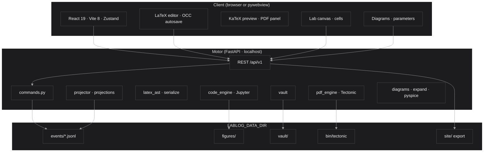
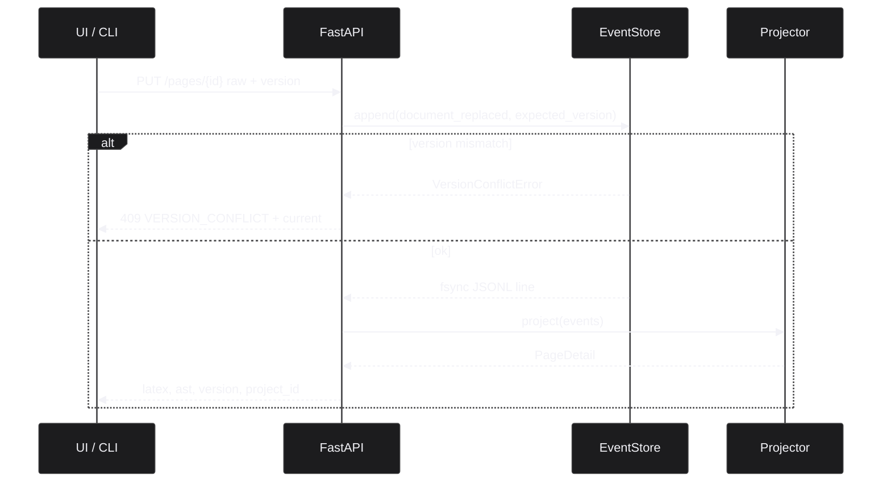

<div align="center">


# lablog

**Bitácora de laboratorio LaTeX en vivo para científicos en activo**

*Proyecto Pharos · José Labarca Baeza · Universidad Técnica Federico Santa María · Valparaíso*

<br/>


<br/>

<p>
  <a href="https://pypi.org/project/jose-labarca-lablog/"></a>
  <a href="https://pypi.org/project/jose-labarca-lablog/"></a>
  <a href="https://pypi.org/project/jose-labarca-lablog/"></a>
  <a href="https://github.com/kegouro/lablog/actions/workflows/ci.yml"></a>
  <a href="https://github.com/kegouro/lablog/actions/workflows/pages.yml"></a>
  <a href="https://github.com/kegouro/lablog/actions/workflows/release.yml"></a>
  <a href="https://github.com/kegouro/lablog/commits/main"></a>
  <a href="https://github.com/kegouro/lablog/issues"></a>
  <a href="https://github.com/kegouro/lablog/pulls"></a>
  <a href="https://github.com/kegouro/lablog/stargazers"></a>
  <a href="https://github.com/kegouro/lablog/network/members"></a>
  <a href="https://github.com/kegouro/lablog"></a>
  <a href="https://github.com/kegouro/lablog"></a>
  <a href="#pruebas-y-calidad"></a>
  <a href="LICENSE"></a>
  <a href="https://www.repostatus.org/#active"></a>
</p>

<p>
  <a href="README.md"></a>
  <a href="README.es.md"></a>
  <a href="https://kegouro.github.io/lablog/"></a>
  <a href="https://pypi.org/project/jose-labarca-lablog/"></a>
  <a href="https://github.com/kegouro/lablog/releases/tag/v0.3.1"></a>
</p>

<sub>
  <a href="#acerca-de">Acerca de</a>
  · <a href="#galería">Galería</a>
  · <a href="#funcionalidades">Funcionalidades</a>
  · <a href="#arquitectura">Arquitectura</a>
  · <a href="#atajos-de-teclado">Atajos</a>
  · <a href="#instalación">Instalación</a>
  · <a href="#tutoriales">Tutoriales</a>
  · <a href="#referencia-cli">CLI</a>
  · <a href="#modelo-de-seguridad">Seguridad</a>
  · <a href="#cómo-citar">Citar</a>
  · <a href="README.es.md">English</a>
</sub>

</div>

---

## Tabla de contenidos

<table>
  <tr>
    <td><a href="#acerca-de"><strong>1. Acerca de</strong></a></td>
    <td><a href="#galería"><strong>2. Galería</strong></a></td>
    <td><a href="#funcionalidades"><strong>3. Funcionalidades</strong></a></td>
    <td><a href="#arquitectura"><strong>4. Arquitectura</strong></a></td>
  </tr>
  <tr>
    <td><a href="#stack"><strong>5. Stack</strong></a></td>
    <td><a href="#instalación"><strong>6. Instalación</strong></a></td>
    <td><a href="#inicio-rápido"><strong>7. Inicio rápido</strong></a></td>
    <td><a href="#tutoriales"><strong>8. Tutoriales</strong></a></td>
  </tr>
  <tr>
    <td><a href="#referencia-cli"><strong>9. CLI</strong></a></td>
    <td><a href="#superficie-http"><strong>10. API HTTP</strong></a></td>
    <td><a href="#banco-de-diagramas"><strong>11. Diagramas</strong></a></td>
    <td><a href="#atajos-de-teclado"><strong>12. Atajos</strong></a></td>
  </tr>
  <tr>
    <td><a href="#modo-laboratorio"><strong>13. Laboratorio</strong></a></td>
    <td><a href="#compilación-pdf-real"><strong>14. PDF</strong></a></td>
    <td><a href="#bóveda-y-adjuntos"><strong>15. Bóveda</strong></a></td>
    <td><a href="#formatos-de-exportación"><strong>16. Exportar</strong></a></td>
  </tr>
  <tr>
    <td><a href="#configuración"><strong>17. Config</strong></a></td>
    <td><a href="#diseño-en-disco"><strong>18. Datos</strong></a></td>
    <td><a href="#modelo-de-seguridad"><strong>19. Seguridad</strong></a></td>
    <td><a href="#pruebas-y-calidad"><strong>20. Pruebas</strong></a></td>
  </tr>
  <tr>
    <td><a href="#publicar-en-github-pages"><strong>21. Pages</strong></a></td>
    <td><a href="#hoja-de-ruta"><strong>22. Roadmap</strong></a></td>
    <td><a href="#cómo-citar"><strong>23. Citar</strong></a></td>
    <td><a href="#licencia"><strong>24. Licencia</strong></a></td>
  </tr>
</table>

---

## Acerca de

> **lablog** es una bitácora de laboratorio de grado de investigación que vive donde ocurre
> el experimento. Combina un editor LaTeX estructural con vista previa en vivo, celdas
> ejecutables, diagramas parametrizados, dictado por voz e historial inmutable por event
> sourcing, de modo que el registro de una investigación pueda reconstruirse tal como se produjo.

A diferencia de un procesador usado *después* del experimento, lablog está pensado para
correr **mientras el trabajo avanza** — instrumento abierto, notas incompletas, valores
aún en movimiento. Premisa: escribir el paper no debería separarse de producir los datos.

| Herramienta | Cuándo se usa habitualmente |
| :--- | :--- |
| Overleaf | Tras el experimento, al preparar el manuscrito. |
| TeXstudio / TeXmacs | Autoría LaTeX clásica en escritorio. |
| Jupyter / JupyterLab | Notebooks computacionales; la prosa es secundaria. |
| **lablog** | **Durante** el experimento: dictar, ejecutar, parametrizar diagramas y preservar. |

### Principios de diseño

1. **Local-first.** Bind por defecto a loopback. Las notas viven en `LABLOG_DATA_DIR`.
2. **Event sourcing, no mutación silenciosa.** Las escrituras anexan eventos inmutables; el estado es proyección pura.
3. **Preview aproximada + PDF fiel.** KaTeX para velocidad; Tectonic para verdad tipográfica.
4. **Peso opcional.** El núcleo es liviano; voz, escritorio y PySpice son extras.
5. **Seguridad como corrección.** Path traversal, shell-escape, límites de tamaño y OCC son invariantes, no parches a posteriori.

### Estado

| Ítem | Valor |
| :--- | :--- |
| Distribución | [`jose-labarca-lablog`](https://pypi.org/project/jose-labarca-lablog/) en PyPI |
| Versión actual | **v0.3.1** ([notas](docs/release-notes-v0.3.1.md)) |
| Licencia | MIT |
| Lenguaje principal (motor) | Python 3.11+ |
| Lenguaje principal (UI) | TypeScript / React 19 |
| Mantenedor | José Labarca Baeza |

---

## Galería

Capturas reales de una instancia en ejecución (Vite + FastAPI, dark theme, v0.3.x). Script de regeneración: [`scripts/capture_ui_screenshots.mjs`](scripts/capture_ui_screenshots.mjs).

<div align="center">

### Mesa de trabajo


<sub>Figure 1. Shell principal: grupos de proyecto, editor LaTeX estructural, vista previa (<code>\section</code>, equation, <code>% lablog-param</code>).</sub>

<br/><br/>

### Presets de diagramas


<sub>Figure 2. Banco de diagramas: presets de circuitos / control / óptica con Insertar, +Sim y SPICE.</sub>

<br/><br/>

### Parámetros


<sub>Figure 3. Panel de parámetros: valores, resaltado dual, reaplicar diagrama / reaplicar + sim.</sub>

<br/><br/>

### Modo laboratorio


<sub>Figure 4. Modo laboratorio: layout denso de celdas, fuente Python, controles de ejecución.</sub>

<br/><br/>

### Preferencias y atajos de teclado


<sub>Figure 5. Preferencias: fuente del editor, paletas, color de acento y chords globales editables (<code>mod+…</code>).</sub>

<br/><br/>

### Vista de ajustes


<sub>Figure 6. Superficie completa de preferencias (densidad, movimiento, layout laboratorio, import/export JSON).</sub>

<br/><br/>

### Panel de celdas


<sub>Figure 7. Documento con <code>\begin{python}</code> y parámetros abiertos para reaplicar.</sub>

<br/><br/>

### Identidad y arquitectura


&nbsp;


<sub>Figure 8. Kit de identidad e ilustración de arquitectura por capas.</sub>

</div>

---

## Funcionalidades

<table>
  <thead>
    <tr>
      <th align="left">Módulo</th>
      <th align="left">Capacidad</th>
    </tr>
  </thead>
  <tbody>
    <tr>
      <td><strong>Render LaTeX estructural</strong></td>
      <td>Secciones, énfasis, listas, hipervínculos y matemática inline en la prosa. KaTeX para entornos de display (<code>align</code>, <code>equation</code>, <code>gather</code>, <code>cases</code>, <code>pmatrix</code>) con numeración automática de ecuaciones.</td>
    </tr>
    <tr>
      <td><strong>Editor</strong></td>
      <td>Gutter de líneas, overlay de parámetros, auto-guardado con OCC, buscar y reemplazar, undo/redo que sobrevive a inserts programáticos, wrap inteligente de delimitadores, snippets y símbolos en el cursor.</td>
    </tr>
    <tr>
      <td><strong>Dictado por voz</strong></td>
      <td><code>SpeechRecognition</code> del navegador con parseo de intent, más Whisper local opcional (extra <code>[voice]</code>). Timeout de sesión para evitar reconocedores colgados.</td>
    </tr>
    <tr>
      <td><strong>Celdas ejecutables</strong></td>
      <td><code>\begin{python}...\end{python}</code> (y celdas de lab mode) corren en un kernel Jupyter real. Stdout, resultados y figuras vuelven al documento; el kernel se interrumpe con timeout.</td>
    </tr>
    <tr>
      <td><strong>Bóveda</strong></td>
      <td>Adjunta imágenes, CSV, PDF, DOCX, audio y scripts; preview in situ. Meta atómica; solo basename; techo de 100&nbsp;MB; borrado diferido.</td>
    </tr>
    <tr>
      <td><strong>Historial event-sourced</strong></td>
      <td>Cada edición, ejecución y adjunto es JSONL append-only. El UI de time-travel recorre y restaura cualquier índice de evento con OCC consciente de versión en el cliente.</td>
    </tr>
    <tr>
      <td><strong>Banco de diagramas</strong></td>
      <td>Doce presets parametrizados (circuitos, control, mecánica, óptica, Feynman). Reaplicar sin <code>{{placeholders}}</code> vía <code>% lablog-param</code>. Highlight dual (línea del editor + color Circuitikz). Celdas PySpice opcionales con fallback numpy.</td>
    </tr>
    <tr>
      <td><strong>Personalización</strong></td>
      <td>Density, editor font, Nord palette, reduced motion, profiles (Laboratory / Paper / Teaching), exportable preferences JSON, configurable keyboard shortcuts.</td>
    </tr>
    <tr>
      <td><strong>Exportación</strong></td>
      <td><code>.tex</code>, texto plano, HTML, PDF, DOCX (pandoc), <strong>Jupyter <code>.ipynb</code></strong>, sitio estático para GitHub Pages, HTML listo para Canva. Títulos escapados para LaTeX.</td>
    </tr>
    <tr>
      <td><strong>Escritorio</strong></td>
      <td>Ventana nativa vía <code>pywebview</code> (<code>[desktop]</code>); bundle portable PyInstaller para distribución offline.</td>
    </tr>
  </tbody>
</table>

---

## Arquitectura

<div align="center">

</div>



### Event sourcing



**Reglas aplicadas en el código y en CONTRIBUTING:**

1. Nunca mutar el AST proyectado desde la API; anexar un evento y re-proyectar.
2. Rutas solo a través de `src/lablog/config.py`.
3. Formas de respuesta reflejadas en `ui/src/lib/api.ts`.
4. I/O de red fuera de componentes hoja cuando sea posible (Zustand + hooks).
5. Diagramas: presets en `catalog.py`, clamp/expand en `expand.py`, SPICE opcional en `pyspice_sim.py`.

<details>
<summary><strong>Módulo map (source tree)</strong></summary>

<br/>

| Ruta | Responsabilidad |
| :--- | :--- |
| [`src/lablog/api.py`](src/lablog/api.py) | Superficie HTTP, OCC en replace, bóveda, diagramas, export. |
| [`src/lablog/event_store.py`](src/lablog/event_store.py) | JSONL append-only; lock por página; append condicional (`expected_version`). |
| [`src/lablog/events.py`](src/lablog/events.py) | Tipos de evento y constructores. |
| [`src/lablog/projector.py`](src/lablog/projector.py) | Fold puro de eventos al estado de página. |
| [`src/lablog/projections.py`](src/lablog/projections.py) | Modelos de lectura: detail, summary, history, cells. |
| [`src/lablog/commands.py`](src/lablog/commands.py) | Comandos de dominio (create, replace, cells, restore). |
| [`src/lablog/latex_ast.py`](src/lablog/latex_ast.py) | Parse / serialización del árbol del documento. |
| [`src/lablog/code_engine.py`](src/lablog/code_engine.py) | Kernel Jupyter con interrupt por timeout. |
| [`src/lablog/vault.py`](src/lablog/vault.py) | Adjuntos, meta atómica, programación de borrado. |
| [`src/lablog/exporter.py`](src/lablog/exporter.py) | Export de sitio estático y notebook. |
| [`src/lablog/pdf_engine.py`](src/lablog/pdf_engine.py) | Install/warm/compile Tectonic y mapeo de errores. |
| [`src/lablog/diagrams/`](src/lablog/diagrams/) | Presets, expand, highlight, PySpice / numpy. |
| [`src/lablog/cli.py`](src/lablog/cli.py) | Punto de entrada `lablog`. |
| [`ui/src/stores/app-store.ts`](ui/src/stores/app-store.ts) | Estado del cliente, preferencias, hooks de flush. |
| [`ui/src/hooks/use-page-update.ts`](ui/src/hooks/use-page-update.ts) | Autosave con debounce, PUT serializado, reintento 409. |
| [`ui/src/components/editor/latex-editor.tsx`](ui/src/components/editor/latex-editor.tsx) | Superficie del editor. |
| [`ui/src/components/lab/lab-canvas.tsx`](ui/src/components/lab/lab-canvas.tsx) | Modo lab; flush de celdas dirty al salir. |

</details>

---

## Stack

| Capa | Tecnologías |
| :--- | :--- |
| Motor | Python 3.11+, FastAPI, Pydantic v2, Jupyter Client, optional faster-whisper / PySpice |
| Persistencia | JSONL event log, atomic renames for vault meta, deterministic projection |
| Interfaz | React 19, TypeScript, Vite 8, Tailwind CSS v4, Zustand, shadcn/ui, Radix |
| Matemática | KaTeX (preview); Tectonic / XeTeX (PDF) |
| Herramientas | uv, npm, Ruff, Mypy (strict), oxlint, pytest (≥80% cov), Vitest, Playwright (smoke), pre-commit, GitHub Accións |

---

## Instalación

### Desde PyPI (recomendado)

```bash
pip install -U jose-labarca-lablog
lablog serve
```

Abre la UI servida por el motor (la rueda incluye `ui/dist` compilado), o apunta un
front de desarrollo a la API.

| Extra | Instalación | Propósito |
| :--- | :--- | :--- |
| Escritorio | `pip install "jose-labarca-lablog[desktop]"` | Ventana nativa (`lablog app`) |
| Voz offline | `pip install "jose-labarca-lablog[voice]"` | Whisper local (descarga grande) |
| SPICE | `pip install "jose-labarca-lablog[pyspice]"` | Celdas PySpice (requiere `ngspice` en PATH) |
| Dev | `pip install "jose-labarca-lablog[dev]"` | pytest, ruff, mypy, bandit, pre-commit |

### Desde el código fuente

> **Requisitos.** Python ≥ 3.11, Node 22, [uv](https://docs.astral.sh/uv/), `npm`.
> Opcional: `pandoc` (+ TeX) para DOCX/PDF vía pandoc; Tectonic lo gestiona lablog para el PDF in-app.

```bash
git clone https://github.com/kegouro/lablog.git
cd lablog
uv sync --extra dev
source .venv/bin/activate
cp .env.example .env

cd ui && npm install && cd ..
```

```bash
# Optional extras
uv sync --extra desktop
uv sync --extra voice
uv sync --extra pyspice
```

---

## Inicio rápido

### Desarrollo (dos procesos)

```bash
# Terminal A — API
source .venv/bin/activate
uvicorn lablog.api:app --host 127.0.0.1 --port 8000 --reload

# Terminal B — UI
cd ui && npm run dev
```

| Surface | URL |
| :--- | :--- |
| UI (Vite) | http://127.0.0.1:5173 |
| API | http://127.0.0.1:8000/api/v1 |
| Health | http://127.0.0.1:8000/api/v1/health |
| OpenAPI | http://127.0.0.1:8000/docs |

### Un proceso (tipo producción)

```bash
cd ui && npm run build && cd ..
uvicorn lablog.api:app --host 127.0.0.1 --port 8000
# or
lablog serve --host 127.0.0.1 --port 8000
```

### Escritorio

```bash
uv sync --extra desktop
cd ui && npm run build && cd ..
lablog app
```

### Smoke de una línea (solo API)

```bash
curl -s http://127.0.0.1:8000/api/v1/health | python -m json.tool
```

---

## Tutoriales

### Tutorial 1 — Primera página por CLI

```bash
source .venv/bin/activate

# Crear una página vacía
lablog create-page --title "RC lab session"

# O sembrar desde una plantilla de física
lablog new --title "Optics notes" --template article_physics

lablog list-pages
lablog render <page_id>          # print projected LaTeX
lablog events <page_id>          # inspect JSONL history
```

### Tutorial 2 — Circuito RC parametrizado en la UI

1. Arrancar API + UI (Inicio rápido).
2. Crear una página desde la barra lateral.
3. Abrir **Diagramas** → **RC serie — carga**.
4. Insertar diagrama (o insertar + celda de simulación).
5. Abrir **Parámetros**: ajustar `R`, `C`, `V0`.
6. Reaplicar; confirmar comentarios `% lablog-param` y actualización TikZ.
7. Enfocar un parámetro: resaltado dual (línea del gutter + `color=` en Circuitikz).
8. Exportar **Notebook Jupyter (.ipynb)** o **Compilar PDF**.

```bash
# Expansión equivalente por CLI
lablog diagrams list
lablog diagrams expand rc_series_charge --json
```

### Tutorial 3 — Celda ejecutable y figura

En el editor (o modo Laboratorio):

```latex
\begin{python}[label=demo]
import numpy as np
import matplotlib.pyplot as plt
t = np.linspace(0, 5, 200)
plt.plot(t, np.exp(-t))
plt.xlabel("t")
plt.ylabel("e^{-t}")
\end{python}
```

Ejecuta la celda desde el panel **Celdas** o el canvas de Lab. Salida y figuras se guardan en
`LABLOG_DATA_DIR/figures/<page_id>/` y se proyectan en el AST.

### Tutorial 4 — Time travel y OCC

1. Edita la página varias veces (autosave ~300&nbsp;ms de inactividad).
2. Abre historial / time-travel; recorre el índice de eventos; restaura una versión pasada.
3. Ediciones concurrentes: el cliente envía `version`; en conflicto la API responde `409` con
   `error_code: VERSION_CONFLICT` y `current`. El UI reintenta una vez o reencola el draft.

### Tutorial 5 — Sitio estático para GitHub Pages

```bash
source .venv/bin/activate
# Preferible versionar datos dentro del repo para notas públicas:
# LABLOG_DATA_DIR=./data

python - <<'PY'
from lablog.exporter import export_site
print(export_site())
PY
```

Enable **Settings → Pages → GitHub Accións** on a fork; [`.github/workflows/pages.yml`](.github/workflows/pages.yml)
publishes on push to `main`.

---

## Referencia CLI

```text
lablog {create-page,new,list-pages,append-text,render,events,serve,app,diagrams}
```

| Comando | Propósito |
| :--- | :--- |
| `create-page` | Crear una página (título / proyecto). |
| `new` | Crear página; `--template` opcional. |
| `list-pages` | Listar resúmenes de páginas. |
| `append-text` | Anexar evento de texto. |
| `render` | Proyectar e imprimir LaTeX. |
| `events` | Volcar el log de eventos de una página. |
| `serve` | API con uvicorn (sirve UI si está build). |
| `app` | Shell de escritorio (`[desktop]`). |
| `diagrams list` | Catálogo de presets. |
| `diagrams expand <id>` | Expandir TikZ (+ params) a stdout / JSON. |

Ejemplos:

```bash
lablog serve --host 127.0.0.1 --port 8000
lablog diagrams list
lablog diagrams expand thin_lens --set f=0.1 --set do=0.3
```

---

## Superficie HTTP

Ruta base: **`/api/v1`**. Esquema interactivo: `/docs` (Swagger) con el servidor en marcha.

<details>
<summary><strong>Core resources (summary)</strong></summary>

<br/>

| Method | Path | Notas |
| :--- | :--- | :--- |
| GET | `/health` | Liveness / flags del motor. |
| GET/POST | `/pages` | Listar / crear (`title`, `project_id` acotados). |
| GET/PUT/PATCH/DELETE | `/pages/{id}` | Detail (incl. `project_id`, `updated_at`, `version`); replace raw con OCC; metadata; soft-delete. |
| POST | `/pages/{id}/text`, `/math`, `/voice`, `/replace` | Inserciones de dominio / replace. |
| GET | `/pages/{id}/history`, `/at/{i}`, POST `/restore/{i}` | Time travel. |
| POST/GET | `/pages/{id}/cells...` | Insert, update (**devuelve `version`**), execute, move (**devuelve `version`**), figure. |
| GET/POST | `/diagrams/presets...` | Listar, expand, simulate-source, apply. |
| GET/POST | `/snippets...`, `/latex-symbols...` | Catálogos y favoritos. |
| GET/POST | `/vault...` | Upload, preview, download, borrado diferido, purge. |
| GET/POST | `/pdf/*`, `/pages/{id}/export/*` | Estado del motor, install, compile, export multi-formato. |
| POST | `/export` | Export del sitio estático. |

</details>

**Contrato OCC (PUT raw / replace):**

```json
{
  "detail": {
    "error_code": "VERSION_CONFLICT",
    "message": "La página cambió en otro cliente; recarga e inténtalo de nuevo",
    "expected": 5,
    "current": 6
  }
}
```

El append condicional es atómico bajo el lock por página (`EventStore.append(..., expected_version=)`).

---

## Banco de diagramas

| `preset_id` | Title | Category |
| :--- | :--- | :--- |
| `voltage_divider` | Divisor de tensión | circuitos |
| `noninverting_opamp` | Op-amp no inversor | circuitos |
| `wheatstone` | Puente de Wheatstone (DC) | circuitos |
| `rc_lowpass` | RC pasa-bajos | circuitos |
| `rc_series_charge` | RC serie — carga | circuitos |
| `half_wave_rectifier` | Rectificador media onda + C | circuitos |
| `rlc_series_step` | RLC serie — escalón | circuitos |
| `second_order_step` | 2º orden — respuesta al escalón | control |
| `pi_controller` | PI + planta 1er orden | control |
| `mass_spring_damper` | Masa-resorte-amortiguador | mecanica |
| `thin_lens` | Lente delgada | optica |
| `qed_moller` | QED e⁻e⁻ (árbol) | particulas |

Los presets con soporte PySpice degradan a código numpy pedagógico si faltan PySpice / ngspice.
Cabeceras en el LaTeX generado:

```latex
% lablog-diagram: preset=rc_series_charge version=1
% lablog-param: C=1e-06
% lablog-param: R=1000
% lablog-highlight: R
```

---

## Atajos de teclado

`mod` es **⌘** en macOS y **Ctrl** en Windows / Linux. Los chords se editan en
**Preferencias → Atajos** y se exportan con el JSON de preferencias.

### Globales (configurables)

| Acción | Chord por defecto | Visualización macOS | Notas |
| :--- | :--- | :--- | :--- |
| Paleta de comandos | `mod+k` | ⌘K | Pages, panels, profiles |
| Guardar (flush del autosave) | `mod+s` | ⌘S | Forces pending PUT |
| Alternar panel de diagramas | `mod+shift+d` | ⌘⇧D | Sidebar tool |
| Alternar panel de parámetros | `mod+shift+p` | ⌘⇧P | Sliders / re-apply |
| Alternar panel de celdas | `mod+shift+c` | ⌘⇧C | Executable cells |
| Alternar modo laboratorio | `mod+shift+l` | ⌘⇧L | Flushes dirty cells on exit |
| Nueva página | `mod+n` | ⌘N | Creates via API |

Fuente de verdad: [`ui/src/lib/shortcuts.ts`](ui/src/lib/shortcuts.ts) (`DEFAULT_SHORTCUTS`).

### Editor (integrados)

| Acción | Shortcut |
| :--- | :---: |
| Buscar / reemplazar | <kbd>Ctrl</kbd>+<kbd>F</kbd> / <kbd>Ctrl</kbd>+<kbd>H</kbd> |
| Siguiente / anterior coincidencia | <kbd>Enter</kbd> / <kbd>Shift</kbd>+<kbd>Enter</kbd> |
| Deshacer / rehacer | <kbd>Ctrl</kbd>+<kbd>Z</kbd> / <kbd>Ctrl</kbd>+<kbd>Y</kbd> |
| Negrita · Cursiva · Math inline | <kbd>Ctrl</kbd>+<kbd>B</kbd> · <kbd>I</kbd> · <kbd>E</kbd> |
| Indentar selección | <kbd>Tab</kbd> |
| Envolver selección en delimitadores | type <kbd>{</kbd> <kbd>(</kbd> <kbd>[</kbd> <kbd>$</kbd> on a selection |

El historial del editor sobrevive a inserciones programáticas (symbols, snippets, voice), donde el undo nativo del navegador suele fallar.

<div align="center">

</div>

---

## Experiencia de editor


Las preferencias (densidad, fuente, paleta, atajos, perfiles) viven en `localStorage` y se
exportan / importan como JSON desde Preferencias.

---

## Modo laboratorio

El modo laboratorio es un layout denso orientado a celdas (Python / markdown / LaTeX cells).

- El source es local hasta blur o guardado explícito; **al salir del lab se hace flush de celdas dirty**
  (toolbar, atajos, command palette, settings y unmount) y se resincroniza
  `activeVersion` vía `GET /pages/{id}`.
- Los perfiles de teclado incluyen **Laboratorio** (densidad compacta, fuente mono, flag lab).

---

## Compilación PDF real

La vista previa es **aproximada** (KaTeX + HTML). La salida fiel usa
[Tectonic](https://tectonic-typesetting.github.io/) (self-contained XeTeX).

- **Compilar PDF** en el encabezado de la preview; la preview se etiqueta **Aproximada**.
- Las celdas Python se renderizan como código + salida + figuras (`fancyvrb`, `\includegraphics`).
- Compilación asíncrona, timeout duro (`504` si se desborda); caché por hash del documento.
- Errores mapeados a la fuente vía marcadores `% lablog-src` (**Celda N · línea M**).
- **Sin `--shell-escape`.** LaTeX no puede ejecutar comandos del SO.
- Binario gestionado: checksum fijado en `LABLOG_DATA_DIR/bin/`; nunca “latest” en runtime.

> lablog es local y monousuario. No expongas el endpoint de compile públicamente sin
> rate limiting y aislamiento.

---

## Bóveda y adjuntos

| Propiedad | Comportamiento |
| :--- | :--- |
| Almacenamiento | `LABLOG_DATA_DIR/vault/` + `meta.json` atómico |
| Nombres de archivo | Solo basename (bloquea `../`) |
| Tamaño | Máx. 100&nbsp;MB → HTTP 413 |
| Ciclo de vida | Borrado programado; force delete con frase de confirmación; purge de expirados |

---

## Formatos de exportación

| Formato | Cómo | Notas |
| :--- | :--- | :--- |
| `.tex` | Menú Exportar | Serialización completa del documento |
| `.txt` | Menú Exportar | Reducción a texto plano |
| `.pdf` | Tectonic in-app o ruta pandoc | Preferir in-app para celdas/figuras |
| `.docx` | pandoc | Requiere pandoc + TeX en docs con mucha matemática |
| `.ipynb` | Menú Exportar | Notebook Jupyter para celdas + markdown |
| Sitio estático | Export / CI | GitHub Pages |
| HTML Canva | Menú Exportar | HTML orientado a presentación |

---

## Configuración

Ver [`.env.example`](.env.example).

| Variable | Default | Propósito |
| :--- | :--- | :--- |
| `LABLOG_DATA_DIR` | `~/.lablog` | Eventos, bóveda, figuras, binarios gestionados |
| `LABLOG_HOST` | `127.0.0.1` | Host de bind de la API |
| `LABLOG_PORT` | `8000` | Puerto de bind de la API (1–65535) |
| `LABLOG_CORS_ORIGINS` | orígenes Vite | Separados por comas |
| `LABLOG_CORS_CREDENTIALS` | `true` | Credenciales CORS |
| `LABLOG_SITE_DIR` | `${data_dir}/site` | Raíz del export estático |

Nunca commitees secretos. Trata `LABLOG_DATA_DIR` como datos personales de investigación.

---

## Diseño en disco

```text
$LABLOG_DATA_DIR/
├── events/                 # one JSONL stream per page_id
│   └── <uuid>.jsonl
├── vault/                  # attachments + meta.json
├── figures/                # per-page cell figures
│   └── <page_id>/
├── bin/                    # managed tectonic (optional)
└── site/                   # last static export (if configured)
```

Los identificadores de página se limitan a un alfabeto seguro (`[A-Za-z0-9_-]{1,128}`) para que las rutas de filesystem no escapen de la raíz de eventos.

---

## Modelo de seguridad

| Invariante | Mecanismo |
| :--- | :--- |
| page_id no hace traversal | Validación regex en `EventStore` |
| Nombres de upload no escapan la bóveda | Solo basename |
| Tamaño de upload acotado | 100&nbsp;MB → 413 |
| El código de usuario no cuelga el kernel | Deadline + `interrupt_kernel()` |
| Títulos sin inyección LaTeX | Escape de meta-caracteres al exportar |
| Figuras no salen del root de figures | Resolve + check de contención |
| Meta de bóveda concurrent-safe | Tempfile + rename atómico |
| Eventos corruptos no rompen la página | Se omiten líneas JSONL inválidas |
| Soft-delete rechaza escrituras | 409 al mutar |
| OCC en replace de documento | `expected_version` atómico bajo lock |
| Longitud de title / project_id acotada | Pydantic max_length (500 / 128) |
| Aislamiento de Tectonic | Sin shell-escape |

Reporta vulnerabilidades en privado vía GitHub Security Advisories o el perfil del
mantenedor; ver [SECURITY.md](SECURITY.md).

---

## Pruebas y calidad

```bash
# Motor
source .venv/bin/activate
pytest -q
ruff check src tests
mypy -p lablog
bandit -r src/lablog -ll

# UI
cd ui
npx tsc --noEmit
npm run lint
npm test -- --run
npm run build

# E2E opcional
npm run test:e2e:install && npm run test:e2e
```

| Gate | Umbral / herramienta |
| :--- | :--- |
| Cobertura backend | **≥ 80%** (`pytest-cov`) |
| Typecheck | Mypy strict (paquete), `tsc --noEmit` |
| Lint | Ruff, oxlint / pipeline ESLint |
| Pre-commit | whitespace, ruff, mypy, tsc, oxlint |
| CI | [`.github/workflows/ci.yml`](.github/workflows/ci.yml) — backend + frontend |

---

## Publicar en GitHub Pages

Las funciones interactivas (editor, celdas, voz) permanecen locales. El exportador estático
produce un sitio renderizado con KaTeX para compartir.

```bash
source .venv/bin/activate
uv run python - <<'PY'
from lablog.exporter import export_site
print(export_site())
PY
```

1. Repository **Settings → Pages → Source: GitHub Accións**
2. Push to `main`
3. Workflow [`.github/workflows/pages.yml`](.github/workflows/pages.yml) deploys

Instancia en vivo: [kegouro.github.io/lablog](https://kegouro.github.io/lablog/)

---

## Empaquetado de escritorio

```bash
./scripts/package_desktop.sh
# → dist/lablog/  (comprimir y distribuir)
```

Spec: [`lablog.spec`](lablog.spec). El modelo de voz se excluye por defecto. Trata el bundle
como punto de partida verificado para builds portables, no como instalador universal de un clic.

---

## Hoja de ruta

| Hito | Estado |
| :--- | :---: |
| Motor event-sourced + proyección | Hecho |
| Voz → intent → LaTeX | Hecho |
| Render estructural | Hecho |
| Celdas ejecutables + timeout | Hecho |
| Bóveda + borrado diferido | Hecho |
| Editor F&R, undo/redo, insert en cursor | Hecho |
| Export estático + Pages | Hecho |
| Escritorio (pywebview) | Hecho |
| Time-travel restore | Hecho |
| PDF in-app + mapeo de errores | Hecho |
| Autocomplete + plantillas CLI | Hecho |
| Presets de diagramas + reaplicar + highlight dual | Hecho (0.3.0) |
| Export Jupyter + PySpice opcional | Hecho (0.3.0) |
| Perfiles UI + atajos | Hecho (0.3.0) |
| OCC endurecido + flush dirty del lab | Hecho (post-0.3.0) |
| BibTeX / citeproc | Planificado |
| Cross-refs de sección / ecuación | Planificado |
| Colaboración P2P / sync multi-dispositivo | Exploratorio |

---

## Cómo citar

Si lablog apoya trabajo que derive en publicación, cita:

```bibtex
@software{labarca_lablog,
  author  = {Labarca Baeza, José},
  title   = {{lablog}: a live LaTeX laboratory notebook for working scientists},
  year    = {2026},
  version = {0.3.1},
  url     = {https://github.com/kegouro/lablog},
  note    = {Part of the Pharos Project}
}
```

Metadatos legibles por máquina: [`CITATION.cff`](CITATION.cff).

---

## Contribuir

Ver [CONTRIBUTING.md](CONTRIBUTING.md). Seguridad: [SECURITY.md](SECURITY.md).
Conducta: [CODE_OF_CONDUCT.md](CODE_OF_CONDUCT.md). Changelog: [CHANGELOG.md](CHANGELOG.md).

Forma preferida de contribución: PR pequeño, tests del comportamiento que cambias, sin
refactors colaterales. Las reglas de arquitectura en CONTRIBUTING son vinculantes.

---

## Licencia

Publicado bajo la [licencia MIT](LICENSE).

---

## Agradecimientos

lablog forma parte del **Proyecto Pharos** — infraestructura científica y educativa que
debe sentirse local, honesta y reconstruible. Identidad y gráficos: José Labarca Baeza.
Idea original concebida con Vicente Muñoz Tolosa.

<div align="center">


<br/>

<sub>USM · Valparaíso · Chile · para escribir la ciencia mientras se hace</sub>

<br/><br/>

[](https://github.com/kegouro/lablog)
[](https://pypi.org/project/jose-labarca-lablog/)
[](https://kegouro.github.io/lablog/)

</div>
