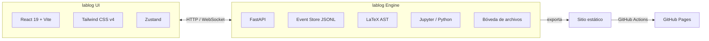

<div align="center">
  
  <br/>
  <br/>

  <h1>lablog</h1>

  <p><strong>Segundo cerebro científico</strong><br/>
  Bitácora de laboratorio con LaTeX en vivo, dictado de voz, ejecución integrada de código y bóveda segura de archivos.</p>

  <p>
    
    
    
    
    
    
  </p>

  <p>
    <a href="#-qué-es">Qué es</a> ·
    <a href="#-características">Características</a> ·
    <a href="#-arquitectura">Arquitectura</a> ·
    <a href="#-instalación-y-desarrollo">Instalación</a> ·
    <a href="#-memoria-y-sincronización">Memoria</a> ·
    <a href="#-github-pages">GitHub Pages</a>
  </p>
</div>

---

## 🧪 ¿Qué es lablog?

**lablog** es un acelerador de investigación para físicos experimentales y científicos de laboratorio. No reemplaza al paper final; lo acompaña **mientras el experimento está sucediendo**.

| Herramienta | Cuándo la usas |
|-------------|----------------|
| **Overleaf** | Cuando el experimento ya terminó y escribes el paper. |
| **TeXstudio** | Cuando editas LaTeX de forma tradicional en tu escritorio. |
| **lablog** 🧠 | Cuando tienes las manos ocupadas, guantes puestos, mirando un instrumento y necesitas **dictar, ejecutar y preservar** todo. |

> “Un cuaderno de laboratorio físico, pero con LaTeX en vivo, celdas ejecutables y memoria inmutable.”

---

## ✨ Características

<div align="center">

| 🎙️ Voz → LaTeX | 🧪 Modo Laboratorio | 🐍 Celdas ejecutables |
|---|---|---|
| Dictado con STT + detector de intención matemática + LLM local que inserta ecuaciones directamente en el AST del documento. | Interfaz hands-free con botón gigante de grabación, pensada para usar con las manos ocupadas. | Escribe `\begin{python}...\end{python}` y ejecuta código que genera figuras, tablas y resultados en la misma página. |

| 📦 Bóveda por página | 🕰️ Time-Travel | 🌐 GitHub Pages |
|---|---|---|
| Adjunta imágenes, CSV, PDF, DOCX, audio y scripts; visualízalos sin salir de la app. | Event sourcing JSONL: cada cambio es un evento inmutable. Navega por el historial como en un cuaderno real. | Exporta un sitio estático con un clic y publícalo automáticamente con GitHub Actions. |

</div>

### Otras capacidades

- **LaTeX en vivo:** editor + preview sincronizados con KaTeX.
- **Modo dump:** graba todo, depura después e inserta cuando quieras.
- **Ingesta mágica:** arrastra un CSV y lablog sugiere graficarlo o generar una tabla LaTeX.
- **Eliminación segura:** slider de destrucción + time-lock de 7 días.
- **Agrupación por proyecto:** organiza tus páginas en proyectos directamente desde el sidebar.
- **Exportable:** sitio estático, PDF, `.tex`, HTML, Markdown, Jupyter notebook y `.lablog` encriptado (en desarrollo).
- **Arquitectura modular:** motor Python separado de la UI, diseñada para plugins y futura colaboración P2P.

---

## 🏗️ Arquitectura



El motor es independiente de la interfaz, testeable por CLI y extensible mediante plugins.

---

## 🚀 Instalación y desarrollo

### 1. Clona e instala

```bash
git clone https://github.com/kegouro/lablog.git
cd lablog
uv sync --extra dev
source .venv/bin/activate
cp .env.example .env
```

### 2. Levanta el backend

```bash
source .venv/bin/activate
uvicorn lablog.api:app --host 127.0.0.1 --port 8000 --reload
```

### 3. Levanta el frontend

```bash
cd ui
npm install
npm run dev
```

Abre:

- **UI:** http://127.0.0.1:5173
- **API:** http://127.0.0.1:8000/api/v1

Para producción local con el build estático:

```bash
source .venv/bin/activate
uvicorn lablog.api:app --host 127.0.0.1 --port 8000
```

Puedes cambiar el directorio de datos, host, puerto y orígenes CORS editando `.env`.

---

## 💾 Memoria y sincronización

lablog guarda tus notas localmente en `LABLOG_DATA_DIR` (por defecto `~/.lablog`). Para que no se pierdan entre máquinas, apunta el directorio de datos dentro del repo:

```bash
# .env
LABLOG_DATA_DIR=./data
```

Luego commitea la carpeta `data/` junto con tu código:

```bash
git add data/
git commit -m "notas: sincroniza data"
```

---

## 🌐 GitHub Pages

1. En la UI ve a **Exportar → Sitio estático (GitHub Pages)**, o ejecuta:

```bash
source .venv/bin/activate
uv run python - <<'PY'
from lablog.exporter import export_site
export_site()
PY
```

2. El sitio se genera en `./site` (o `LABLOG_SITE_DIR`).
3. Activa GitHub Pages en la configuración del repo con fuente **GitHub Actions**.
4. El workflow `.github/workflows/pages.yml` publicará automáticamente el sitio en cada push a `main`.

> **Nota:** la app interactiva (editor, celdas, dictado) sigue siendo local. GitHub Pages solo muestra una versión estática de tus notas, con LaTeX renderizado por KaTeX.

---

## 📁 Documentación

- [`docs/DESIGN.md`](docs/DESIGN.md) — diseño arquitectónico completo.
- [`docs/IMPLEMENTATION_PLAN.md`](docs/IMPLEMENTATION_PLAN.md) — fases, tareas y checklist de implementación.
- [`docs/assets/`](docs/assets/) — banner, logo y graphic kit.

---

## 🗺️ Roadmap

- [x] Engine Python con Event Sourcing, AST LaTeX, CLI y tests.
- [x] Prototipo funcional de Voz → LaTeX con pipeline de capas.
- [x] Integración Voz → Event Store → AST → LaTeX.
- [x] UI web funcional: editor + preview KaTeX, bóveda, snippets, símbolos, tema/personalización.
- [x] Modo laboratorio con celdas ejecutables (Python/Markdown/LaTeX).
- [x] Previsualización de archivos de bóveda (CSV, PDF, DOCX, imágenes, texto).
- [x] Agrupación de páginas por proyecto y CRUD completo.
- [x] Exportación a sitio estático y despliegue en GitHub Pages.
- [ ] Empaquetado Tauri para escritorio.
- [ ] Colaboración P2P y sincronización entre dispositivos.
- [ ] Exportación completa a PDF, `.tex`, Markdown, Jupyter y `.lablog` encriptado.

---

## 👤 Autor y créditos

**lablog** es parte del **Pharos Project**.

```
┌─
│ Pharos Project · José Labarca Baeza
│ Idea original con Vicente
└─ USM · Valparaíso · Chile
```

Diseño de identidad visual, logo y banner por **José Labarca Baeza**.

---

<sub>Parte del **[Pharos Project](https://kegouro.github.io)** — infraestructura científica y educativa sin barreras de entrada. · José Labarca Baeza</sub>

<div align="center">
  <p><em>Construido para que la ciencia fluya.</em></p>
  <p>⭐ Si lablog te resulta útil, considera darle una estrella al repo.</p>
</div>
