<div align="center">

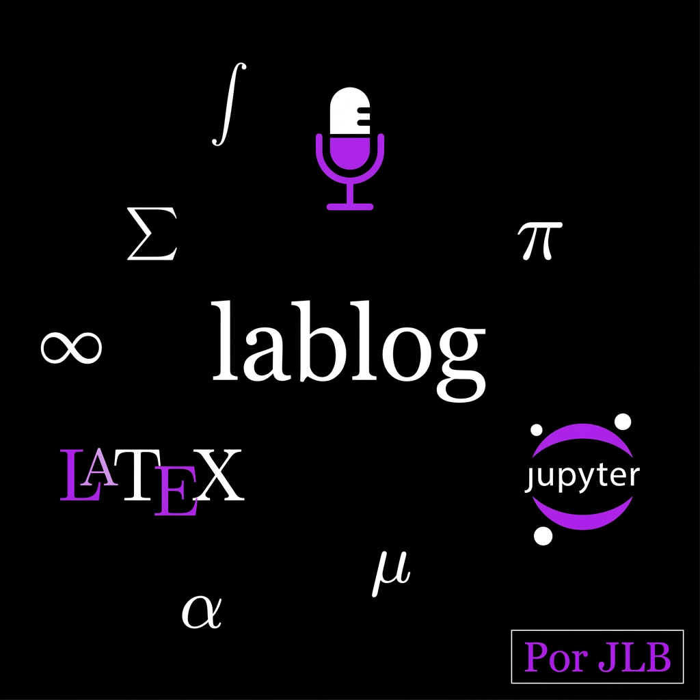

# lablog

**A live LaTeX laboratory notebook for working scientists**

*Part of the Pharos Project · José Labarca Baeza · Universidad Técnica Federico Santa María · Valparaíso*

<br/>

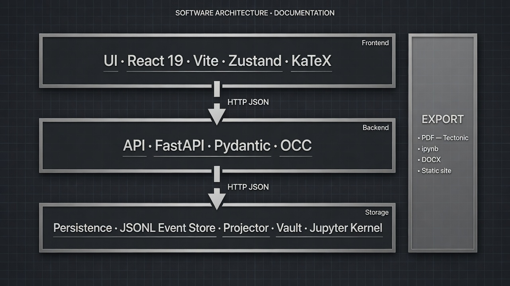

<br/>

<p>
  <a href="https://pypi.org/project/jose-labarca-lablog/"></a>
  <a href="https://pypi.org/project/jose-labarca-lablog/"></a>
  <a href="https://pypi.org/project/jose-labarca-lablog/"></a>
  <a href="https://github.com/kegouro/lablog/actions/workflows/ci.yml"></a>
  <a href="https://github.com/kegouro/lablog/actions/workflows/pages.yml"></a>
  <a href="https://github.com/kegouro/lablog/actions/workflows/release.yml"></a>
  <a href="https://github.com/kegouro/lablog/commits/main"></a>
  <a href="https://github.com/kegouro/lablog/issues"></a>
  <a href="https://github.com/kegouro/lablog/pulls"></a>
  <a href="https://github.com/kegouro/lablog/stargazers"></a>
  <a href="https://github.com/kegouro/lablog/network/members"></a>
  <a href="https://github.com/kegouro/lablog"></a>
  <a href="https://github.com/kegouro/lablog"></a>
  <a href="#testing--quality"></a>
  <a href="LICENSE"></a>
  <a href="https://www.repostatus.org/#active"></a>
</p>

<p>
  <a href="README.md"></a>
  <a href="README.es.md"></a>
  <a href="https://kegouro.github.io/lablog/"></a>
  <a href="https://pypi.org/project/jose-labarca-lablog/"></a>
  <a href="https://github.com/kegouro/lablog/releases/tag/v0.3.0"></a>
</p>

<sub>
  <a href="#about">About</a>
  · <a href="#gallery">Gallery</a>
  · <a href="#features">Features</a>
  · <a href="#architecture">Architecture</a>
  · <a href="#keyboard-shortcuts">Shortcuts</a>
  · <a href="#installation">Install</a>
  · <a href="#tutorials">Tutorials</a>
  · <a href="#cli-reference">CLI</a>
  · <a href="#security-model">Security</a>
  · <a href="#citing">Cite</a>
  · <a href="README.es.md">Español</a>
</sub>

</div>

---

## Table of contents

<table>
  <tr>
    <td><a href="#about"><strong>1. About</strong></a></td>
    <td><a href="#gallery"><strong>2. Gallery</strong></a></td>
    <td><a href="#features"><strong>3. Features</strong></a></td>
    <td><a href="#architecture"><strong>4. Architecture</strong></a></td>
  </tr>
  <tr>
    <td><a href="#stack"><strong>5. Stack</strong></a></td>
    <td><a href="#installation"><strong>6. Installation</strong></a></td>
    <td><a href="#quick-start"><strong>7. Quick start</strong></a></td>
    <td><a href="#tutorials"><strong>8. Tutorials</strong></a></td>
  </tr>
  <tr>
    <td><a href="#cli-reference"><strong>9. CLI</strong></a></td>
    <td><a href="#http-api-surface"><strong>10. HTTP API</strong></a></td>
    <td><a href="#diagram-workbench"><strong>11. Diagrams</strong></a></td>
    <td><a href="#keyboard-shortcuts"><strong>12. Shortcuts</strong></a></td>
  </tr>
  <tr>
    <td><a href="#laboratory-mode"><strong>13. Lab mode</strong></a></td>
    <td><a href="#real-pdf-compilation"><strong>14. PDF</strong></a></td>
    <td><a href="#vault--attachments"><strong>15. Vault</strong></a></td>
    <td><a href="#export-formats"><strong>16. Export</strong></a></td>
  </tr>
  <tr>
    <td><a href="#configuration"><strong>17. Config</strong></a></td>
    <td><a href="#on-disk-layout"><strong>18. Data layout</strong></a></td>
    <td><a href="#security-model"><strong>19. Security</strong></a></td>
    <td><a href="#testing--quality"><strong>20. Testing</strong></a></td>
  </tr>
  <tr>
    <td><a href="#publishing-to-github-pages"><strong>21. Pages</strong></a></td>
    <td><a href="#roadmap"><strong>22. Roadmap</strong></a></td>
    <td><a href="#citing"><strong>23. Citing</strong></a></td>
    <td><a href="#license"><strong>24. License</strong></a></td>
  </tr>
</table>

---

## About

> **lablog** is a research-grade laboratory notebook that lives where the experiment happens.
> It pairs a structural LaTeX editor with live preview, executable cells, parameterised
> diagrams, voice dictation, and an immutable event-sourced history so that the record of
> an investigation can be reconstructed exactly as it unfolded.

Unlike a typesetting tool used *after* the experiment, lablog is designed to run **while
the work is in progress** — instrument open, notes incomplete, values still moving. The
guiding premise is simple: the act of writing the paper should not be separated from the
act of producing the data.

| Tool | When you typically use it |
| :--- | :--- |
| Overleaf | After the experiment, when the manuscript is prepared. |
| TeXstudio / TeXmacs | Traditional desktop LaTeX authoring. |
| Jupyter / JupyterLab | Computational notebooks; prose is secondary. |
| **lablog** | **During** the experiment: dictate, execute, parameterise diagrams, and preserve as it happens. |

### Design principles

1. **Local-first.** Default bind address is loopback. Your notes stay under `LABLOG_DATA_DIR`.
2. **Event sourcing, not silent mutation.** Writes append immutable events; state is a pure projection.
3. **Approximate preview + faithful PDF.** KaTeX is for speed; Tectonic is for truth.
4. **Optional weight.** Core install is lean; voice, desktop, and PySpice are extras.
5. **Security as correctness.** Path traversal, shell-escape, size limits, and OCC are invariants, not afterthoughts.

### Status

| Item | Value |
| :--- | :--- |
| Distribution | [`jose-labarca-lablog`](https://pypi.org/project/jose-labarca-lablog/) on PyPI |
| Current release | **v0.3.0** ([notes](docs/release-notes-v0.3.0.md)) |
| Licence | MIT |
| Primary language (engine) | Python 3.11+ |
| Primary language (UI) | TypeScript / React 19 |
| Maintainer | José Labarca Baeza |

---

## Gallery

Real captures from a running instance (Vite + FastAPI, dark theme, v0.3.x). Regeneration script: [`scripts/capture_ui_screenshots.mjs`](scripts/capture_ui_screenshots.mjs).

<div align="center">

### Workbench

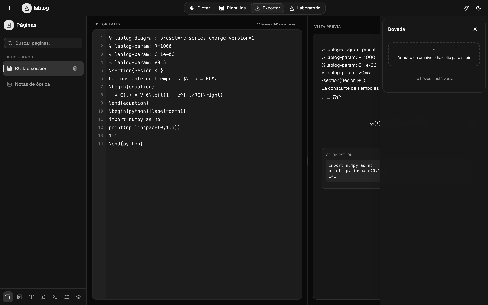

<sub>Figure 1. Main shell: project groups, structural LaTeX editor, live preview (<code>\section</code>, equation, <code>% lablog-param</code>).</sub>

<br/><br/>

### Diagram presets

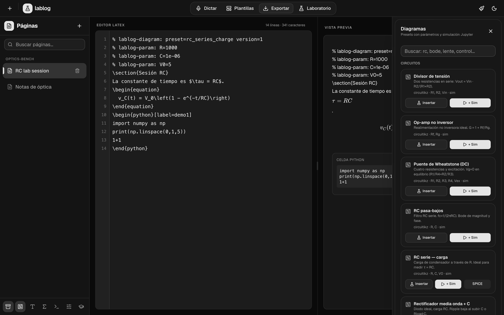

<sub>Figure 2. Diagram workbench: circuit / control / optics presets with Insert, +Sim, and SPICE badges.</sub>

<br/><br/>

### Parameters

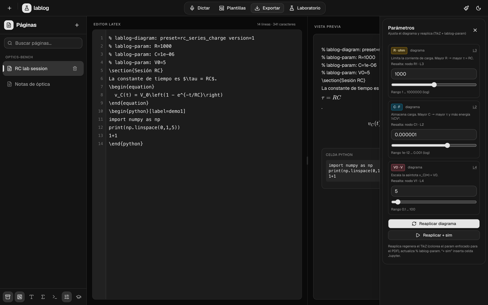

<sub>Figure 3. Parameter panel: dial values, dual highlight targets, re-apply diagram / re-apply + sim.</sub>

<br/><br/>

### Lab mode

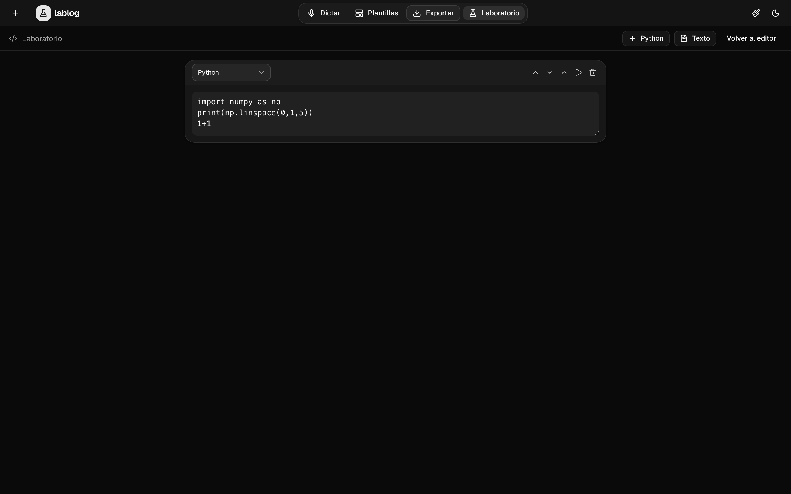

<sub>Figure 4. Laboratory mode: dense cell layout, Python source, run / reorder / delete controls.</sub>

<br/><br/>

### Preferences and keyboard shortcuts

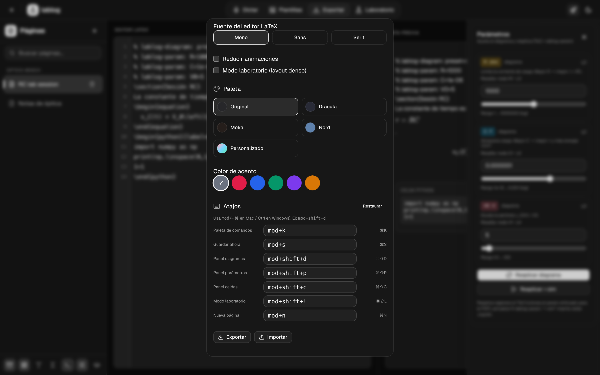

<sub>Figure 5. Preferencias: editor font, palettes, accent colour, and editable global chords (<code>mod+…</code>).</sub>

<br/><br/>

### Settings overview

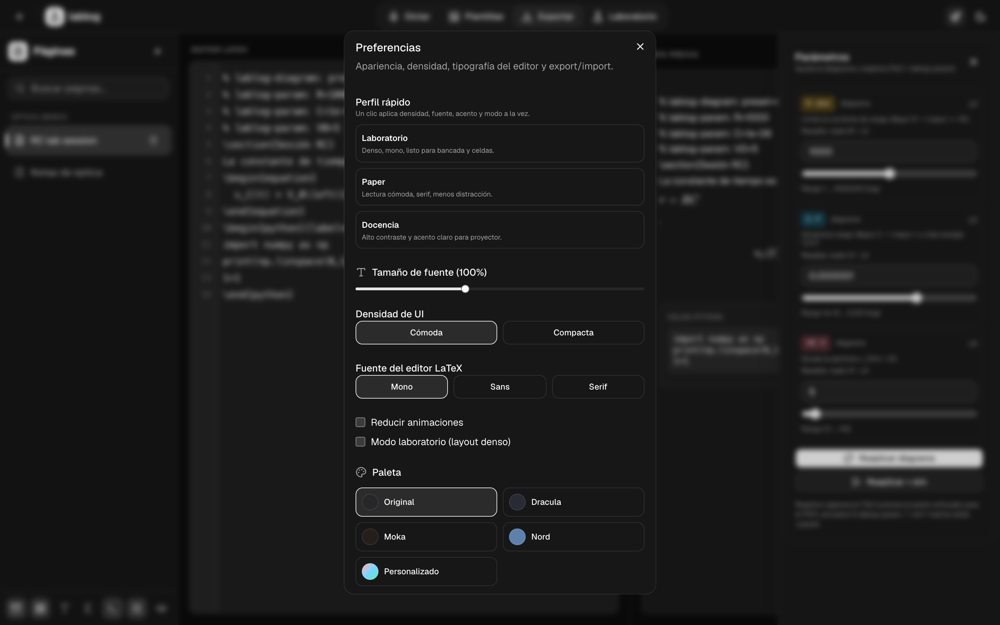

<sub>Figure 6. Full preferences surface (density, motion, laboratory layout, import / export JSON).</sub>

<br/><br/>

### Cells panel

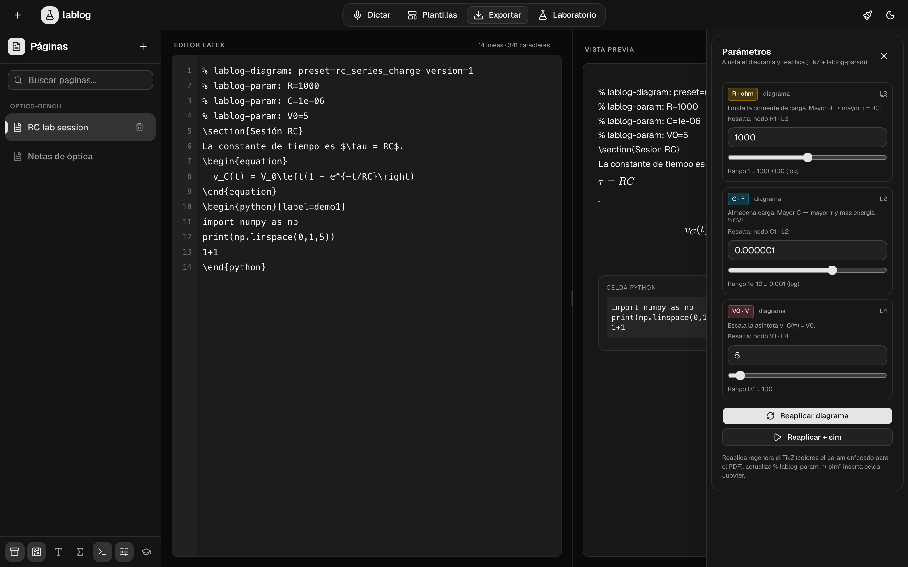

<sub>Figure 7. Document with embedded <code>\begin{python}</code> cell and parameters open for re-apply.</sub>

<br/><br/>

### Brand and architecture art

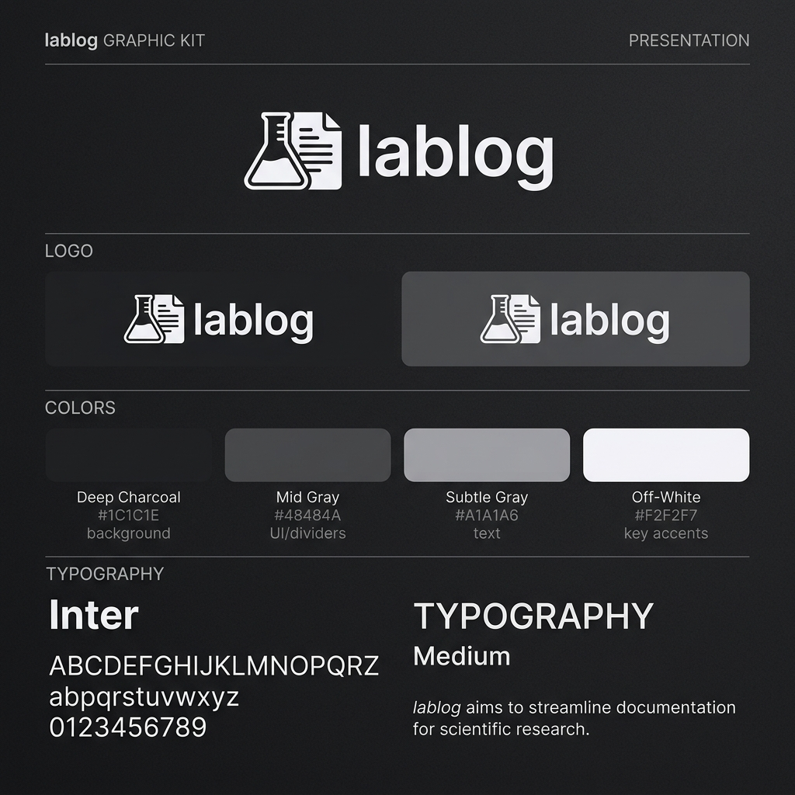
&nbsp;
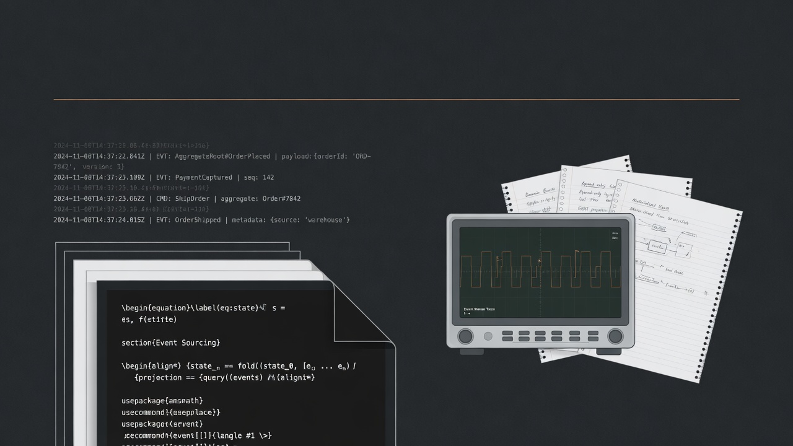

<sub>Figure 8. Identity kit and layered architecture illustration.</sub>

</div>

---

## Features

<table>
  <thead>
    <tr>
      <th align="left">Module</th>
      <th align="left">Capability</th>
    </tr>
  </thead>
  <tbody>
    <tr>
      <td><strong>Structural LaTeX renderer</strong></td>
      <td>Sections, emphasis, lists, hyperlinks, and inline mathematics within prose. KaTeX for display environments (<code>align</code>, <code>equation</code>, <code>gather</code>, <code>cases</code>, <code>pmatrix</code>) with automatic equation numbering.</td>
    </tr>
    <tr>
      <td><strong>Editor</strong></td>
      <td>Line gutter, parameter overlay, debounced auto-save with optimistic concurrency (OCC), find &amp; replace, undo / redo that survives programmatic inserts, smart delimiter wrapping, snippets and symbols at the cursor.</td>
    </tr>
    <tr>
      <td><strong>Voice dictation</strong></td>
      <td>Browser <code>SpeechRecognition</code> with intent parsing, plus optional local Whisper (<code>[voice]</code> extra). Session timeout prevents hung recognisers.</td>
    </tr>
    <tr>
      <td><strong>Executable cells</strong></td>
      <td><code>\begin{python}...\end{python}</code> (and lab-mode cells) run on a real Jupyter kernel. Stdout, results, and figures return into the document; kernels are interrupted on timeout.</td>
    </tr>
    <tr>
      <td><strong>Vault</strong></td>
      <td>Attach images, CSV, PDF, DOCX, audio, scripts; preview in place. Atomic metadata; basename-only filenames; 100&nbsp;MB ceiling; time-locked deletion.</td>
    </tr>
    <tr>
      <td><strong>Event-sourced history</strong></td>
      <td>Every edit, execution, and attachment is append-only JSONL. Time-travel UI scrubs and restores any event index with version-aware OCC on the client.</td>
    </tr>
    <tr>
      <td><strong>Diagram workbench</strong></td>
      <td>Twelve parameterised presets (circuits, control, mechanics, optics, Feynman). Re-apply without <code>{{placeholders}}</code> via <code>% lablog-param</code>. Dual highlight (editor line + Circuitikz colour). Optional PySpice cells with numpy fallback.</td>
    </tr>
    <tr>
      <td><strong>Personalisation</strong></td>
      <td>Density, editor font, Nord palette, reduced motion, profiles (Laboratory / Paper / Teaching), exportable preferences JSON, configurable keyboard shortcuts.</td>
    </tr>
    <tr>
      <td><strong>Export</strong></td>
      <td><code>.tex</code>, plain text, HTML, PDF, DOCX (pandoc), <strong>Jupyter <code>.ipynb</code></strong>, static site for GitHub Pages, Canva-ready HTML. Titles LaTeX-escaped.</td>
    </tr>
    <tr>
      <td><strong>Desktop</strong></td>
      <td>Native window via <code>pywebview</code> (<code>[desktop]</code>); portable PyInstaller bundle for offline distribution.</td>
    </tr>
  </tbody>
</table>

---

## Architecture

<div align="center">

</div>

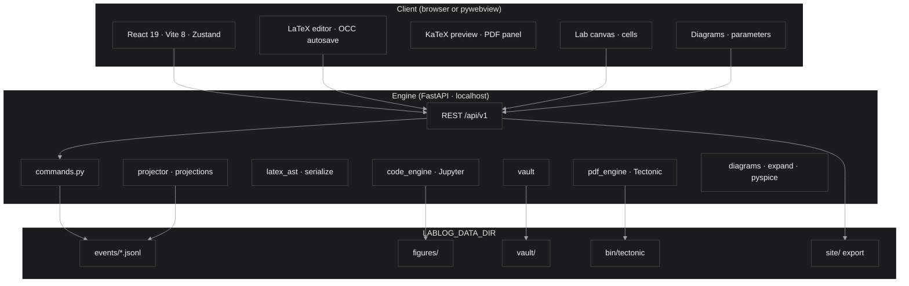

### Event sourcing

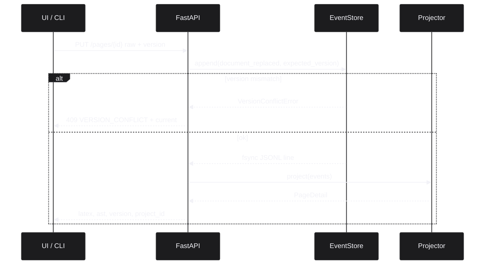

**Rules enforced in code and CONTRIBUTING:**

1. Never mutate the projected AST from the API; append an event and re-project.
2. Paths only through `src/lablog/config.py`.
3. Wire shapes mirrored in `ui/src/lib/api.ts`.
4. Network I/O kept out of leaf components when possible (Zustand + hooks).
5. Diagrams: presets in `catalog.py`, clamp/expand in `expand.py`, SPICE optional in `pyspice_sim.py`.

<details>
<summary><strong>Module map (source tree)</strong></summary>

<br/>

| Path | Responsibility |
| :--- | :--- |
| [`src/lablog/api.py`](src/lablog/api.py) | HTTP surface, OCC on replace, vault, diagrams, export. |
| [`src/lablog/event_store.py`](src/lablog/event_store.py) | Append-only JSONL; per-page lock; conditional append (`expected_version`). |
| [`src/lablog/events.py`](src/lablog/events.py) | Event types and constructors. |
| [`src/lablog/projector.py`](src/lablog/projector.py) | Pure fold of events into page state. |
| [`src/lablog/projections.py`](src/lablog/projections.py) | Read models: detail, summary, history, cells. |
| [`src/lablog/commands.py`](src/lablog/commands.py) | Domain commands (create, replace, cells, restore). |
| [`src/lablog/latex_ast.py`](src/lablog/latex_ast.py) | Parse / serialise document tree. |
| [`src/lablog/code_engine.py`](src/lablog/code_engine.py) | Jupyter kernel with timeout interrupt. |
| [`src/lablog/vault.py`](src/lablog/vault.py) | Attachments, atomic meta, deletion schedule. |
| [`src/lablog/exporter.py`](src/lablog/exporter.py) | Static site and notebook export. |
| [`src/lablog/pdf_engine.py`](src/lablog/pdf_engine.py) | Tectonic install, warm, compile, error mapping. |
| [`src/lablog/diagrams/`](src/lablog/diagrams/) | Presets, expand, highlight, PySpice / numpy. |
| [`src/lablog/cli.py`](src/lablog/cli.py) | `lablog` entry point. |
| [`ui/src/stores/app-store.ts`](ui/src/stores/app-store.ts) | Client state, preferences, flush hooks. |
| [`ui/src/hooks/use-page-update.ts`](ui/src/hooks/use-page-update.ts) | Debounced autosave, serialised PUT, 409 retry. |
| [`ui/src/components/editor/latex-editor.tsx`](ui/src/components/editor/latex-editor.tsx) | Editor surface. |
| [`ui/src/components/lab/lab-canvas.tsx`](ui/src/components/lab/lab-canvas.tsx) | Lab mode; dirty-cell flush on exit. |

</details>

---

## Stack

| Layer | Technologies |
| :--- | :--- |
| Engine | Python 3.11+, FastAPI, Pydantic v2, Jupyter Client, optional faster-whisper / PySpice |
| Persistence | JSONL event log, atomic renames for vault meta, deterministic projection |
| Interface | React 19, TypeScript, Vite 8, Tailwind CSS v4, Zustand, shadcn/ui, Radix |
| Mathematics | KaTeX (preview); Tectonic / XeTeX (PDF) |
| Tooling | uv, npm, Ruff, Mypy (strict), oxlint, pytest (≥80% cov), Vitest, Playwright (smoke), pre-commit, GitHub Actions |

---

## Installation

### From PyPI (recommended)

```bash
pip install -U jose-labarca-lablog
lablog serve
```

Open the UI served by the engine (bundled wheel includes compiled `ui/dist`), or point a
dev front-end at the API.

| Extra | Install | Purpose |
| :--- | :--- | :--- |
| Desktop | `pip install "jose-labarca-lablog[desktop]"` | Native window (`lablog app`) |
| Offline voice | `pip install "jose-labarca-lablog[voice]"` | Local Whisper (large download) |
| SPICE | `pip install "jose-labarca-lablog[pyspice]"` | PySpice cells (needs `ngspice` on PATH) |
| Dev | `pip install "jose-labarca-lablog[dev]"` | pytest, ruff, mypy, bandit, pre-commit |

### From source

> **Prerequisites.** Python ≥ 3.11, Node 22, [uv](https://docs.astral.sh/uv/), `npm`.
> Optional: `pandoc` (+ TeX) for DOCX/PDF via pandoc; Tectonic is managed by lablog for in-app PDF.

```bash
git clone https://github.com/kegouro/lablog.git
cd lablog
uv sync --extra dev
source .venv/bin/activate
cp .env.example .env

cd ui && npm install && cd ..
```

```bash
# Optional extras
uv sync --extra desktop
uv sync --extra voice
uv sync --extra pyspice
```

---

## Quick start

### Development (two processes)

```bash
# Terminal A — API
source .venv/bin/activate
uvicorn lablog.api:app --host 127.0.0.1 --port 8000 --reload

# Terminal B — UI
cd ui && npm run dev
```

| Surface | URL |
| :--- | :--- |
| UI (Vite) | http://127.0.0.1:5173 |
| API | http://127.0.0.1:8000/api/v1 |
| Health | http://127.0.0.1:8000/api/v1/health |
| OpenAPI | http://127.0.0.1:8000/docs |

### Single process (production-like)

```bash
cd ui && npm run build && cd ..
uvicorn lablog.api:app --host 127.0.0.1 --port 8000
# or
lablog serve --host 127.0.0.1 --port 8000
```

### Desktop

```bash
uv sync --extra desktop
cd ui && npm run build && cd ..
lablog app
```

### One-liner smoke (API only)

```bash
curl -s http://127.0.0.1:8000/api/v1/health | python -m json.tool
```

---

## Tutorials

### Tutorial 1 — First page from the CLI

```bash
source .venv/bin/activate

# Create an empty page
lablog create-page --title "RC lab session"

# Or seed from a physics template
lablog new --title "Optics notes" --template article_physics

lablog list-pages
lablog render <page_id>          # print projected LaTeX
lablog events <page_id>          # inspect JSONL history
```

### Tutorial 2 — Parameterised RC circuit in the UI

1. Start API + UI (Quick start).
2. Create a page from the sidebar.
3. Open **Diagrams** → **RC serie — carga**.
4. Insert diagram (or insert + simulation cell).
5. Open **Parameters**: adjust `R`, `C`, `V0`.
6. Re-apply; confirm `% lablog-param` comments and TikZ update.
7. Focus a parameter: dual highlight (gutter line + Circuitikz `color=`).
8. Export **Notebook Jupyter (.ipynb)** or **Compilar PDF**.

```bash
# Equivalent expand from CLI
lablog diagrams list
lablog diagrams expand rc_series_charge --json
```

### Tutorial 3 — Executable cell and figure

In the editor (or Lab mode):

```latex
\begin{python}[label=demo]
import numpy as np
import matplotlib.pyplot as plt
t = np.linspace(0, 5, 200)
plt.plot(t, np.exp(-t))
plt.xlabel("t")
plt.ylabel("e^{-t}")
\end{python}
```

Run the cell from the **Cells** panel or Lab canvas. Output and figures are stored under
`LABLOG_DATA_DIR/figures/<page_id>/` and projected into the AST.

### Tutorial 4 — Time travel and OCC

1. Edit the page several times (autosave every ~300&nbsp;ms of idle).
2. Open history / time-travel; scrub the event index; restore a past version.
3. Concurrent edits: client sends `version`; on conflict the API returns `409` with
   `error_code: VERSION_CONFLICT` and `current`. The UI retries once or requeues the draft.

### Tutorial 5 — Static site for GitHub Pages

```bash
source .venv/bin/activate
# Prefer versioning data inside the repo for public notes:
# LABLOG_DATA_DIR=./data

python - <<'PY'
from lablog.exporter import export_site
print(export_site())
PY
```

Enable **Settings → Pages → GitHub Actions** on a fork; [`.github/workflows/pages.yml`](.github/workflows/pages.yml)
publishes on push to `main`.

---

## CLI reference

```text
lablog {create-page,new,list-pages,append-text,render,events,serve,app,diagrams}
```

| Command | Purpose |
| :--- | :--- |
| `create-page` | Create a page (title / project). |
| `new` | Create page; optional `--template`. |
| `list-pages` | List page summaries. |
| `append-text` | Append text event. |
| `render` | Project and print LaTeX. |
| `events` | Dump event log for a page. |
| `serve` | Run uvicorn-backed API (serves UI if built). |
| `app` | Desktop shell (`[desktop]`). |
| `diagrams list` | Catalogue presets. |
| `diagrams expand <id>` | Expand TikZ (+ params) to stdout / JSON. |

Examples:

```bash
lablog serve --host 127.0.0.1 --port 8000
lablog diagrams list
lablog diagrams expand thin_lens --set f=0.1 --set do=0.3
```

---

## HTTP API surface

Base path: **`/api/v1`**. Interactive schema: `/docs` (Swagger) when the server is running.

<details>
<summary><strong>Core resources (summary)</strong></summary>

<br/>

| Method | Path | Notes |
| :--- | :--- | :--- |
| GET | `/health` | Liveness / engine flags. |
| GET/POST | `/pages` | List / create (`title`, `project_id` bounded). |
| GET/PUT/PATCH/DELETE | `/pages/{id}` | Detail (incl. `project_id`, `updated_at`, `version`); raw replace with OCC; metadata; soft-delete. |
| POST | `/pages/{id}/text`, `/math`, `/voice`, `/replace` | Domain inserts / replace. |
| GET | `/pages/{id}/history`, `/at/{i}`, POST `/restore/{i}` | Time travel. |
| POST/GET | `/pages/{id}/cells...` | Insert, update (**returns `version`**), execute, move (**returns `version`**), figure. |
| GET/POST | `/diagrams/presets...` | List, expand, simulate-source, apply. |
| GET/POST | `/snippets...`, `/latex-symbols...` | Catalogues and favourites. |
| GET/POST | `/vault...` | Upload, preview, download, delayed delete, purge. |
| GET/POST | `/pdf/*`, `/pages/{id}/export/*` | Engine status, install, compile, multi-format export. |
| POST | `/export` | Static site export. |

</details>

**OCC contract (PUT raw / replace):**

```json
{
  "detail": {
    "error_code": "VERSION_CONFLICT",
    "message": "La página cambió en otro cliente; recarga e inténtalo de nuevo",
    "expected": 5,
    "current": 6
  }
}
```

Conditional append is atomic under the per-page file lock (`EventStore.append(..., expected_version=)`).

---

## Diagram workbench

| `preset_id` | Title | Category |
| :--- | :--- | :--- |
| `voltage_divider` | Divisor de tensión | circuitos |
| `noninverting_opamp` | Op-amp no inversor | circuitos |
| `wheatstone` | Puente de Wheatstone (DC) | circuitos |
| `rc_lowpass` | RC pasa-bajos | circuitos |
| `rc_series_charge` | RC serie — carga | circuitos |
| `half_wave_rectifier` | Rectificador media onda + C | circuitos |
| `rlc_series_step` | RLC serie — escalón | circuitos |
| `second_order_step` | 2º orden — respuesta al escalón | control |
| `pi_controller` | PI + planta 1er orden | control |
| `mass_spring_damper` | Masa-resorte-amortiguador | mecanica |
| `thin_lens` | Lente delgada | optica |
| `qed_moller` | QED e⁻e⁻ (árbol) | particulas |

Presets with PySpice support degrade to pedagogical numpy code when PySpice / ngspice
are absent. Headers in generated LaTeX:

```latex
% lablog-diagram: preset=rc_series_charge version=1
% lablog-param: C=1e-06
% lablog-param: R=1000
% lablog-highlight: R
```

---

## Keyboard shortcuts

`mod` is **⌘** on macOS and **Ctrl** on Windows / Linux. Chords are editable under
**Preferencias → Atajos** and exported with preferences JSON.

### Global (configurable)

| Action | Default chord | macOS display | Notes |
| :--- | :--- | :--- | :--- |
| Command palette | `mod+k` | ⌘K | Pages, panels, profiles |
| Save (flush autosave) | `mod+s` | ⌘S | Forces pending PUT |
| Toggle diagrams panel | `mod+shift+d` | ⌘⇧D | Sidebar tool |
| Toggle parameters panel | `mod+shift+p` | ⌘⇧P | Sliders / re-apply |
| Toggle cells panel | `mod+shift+c` | ⌘⇧C | Executable cells |
| Toggle laboratory mode | `mod+shift+l` | ⌘⇧L | Flushes dirty cells on exit |
| New page | `mod+n` | ⌘N | Creates via API |

Source of truth: [`ui/src/lib/shortcuts.ts`](ui/src/lib/shortcuts.ts) (`DEFAULT_SHORTCUTS`).

### Editor (built-in)

| Action | Shortcut |
| :--- | :---: |
| Find / replace | <kbd>Ctrl</kbd>+<kbd>F</kbd> / <kbd>Ctrl</kbd>+<kbd>H</kbd> |
| Next / previous match | <kbd>Enter</kbd> / <kbd>Shift</kbd>+<kbd>Enter</kbd> |
| Undo / redo | <kbd>Ctrl</kbd>+<kbd>Z</kbd> / <kbd>Ctrl</kbd>+<kbd>Y</kbd> |
| Bold · Italic · Inline math | <kbd>Ctrl</kbd>+<kbd>B</kbd> · <kbd>I</kbd> · <kbd>E</kbd> |
| Indent selection | <kbd>Tab</kbd> |
| Wrap selection in delimiters | type <kbd>{</kbd> <kbd>(</kbd> <kbd>[</kbd> <kbd>$</kbd> on a selection |

Editor history survives programmatic insertions (symbols, snippets, voice), where
browser-native undo usually breaks.

<div align="center">

</div>

---

## Editor experience


Preferences (density, font, palette, shortcuts, profiles) live in `localStorage` and can
be exported / imported as JSON from Settings.

---

## Laboratory mode

Lab mode is a dense layout for cell-first work (Python / markdown / LaTeX cells).

- Source is local until blur or explicit save; **leaving lab mode flushes dirty cells**
  (toolbar, shortcuts, command palette, settings, and unmount) and resynchronises
  `activeVersion` via `GET /pages/{id}`.
- Keyboard profiles include a **Laboratory** preset (compact density, mono font, lab flag).

---

## Real PDF compilation

Live preview is **approximate** (KaTeX + HTML). Faithful output uses
[Tectonic](https://tectonic-typesetting.github.io/) (self-contained XeTeX).

- **Compilar PDF** in the preview header; preview labelled **Aproximada**.
- Python cells render as code + output + figures (`fancyvrb`, `\includegraphics`).
- Async compile, hard timeout (`504` on runaway); cache by document hash.
- Errors map to source via `% lablog-src` markers (**Celda N · línea M**).
- **No `--shell-escape`.** LaTeX cannot run OS commands.
- Managed binary: checksum-pinned under `LABLOG_DATA_DIR/bin/`; never “latest” at runtime.

> lablog is local and single-user. Do not expose the compile endpoint publicly without
> rate limiting and isolation.

---

## Vault & attachments

| Property | Behaviour |
| :--- | :--- |
| Storage | `LABLOG_DATA_DIR/vault/` + atomic `meta.json` |
| Filenames | Basename only (blocks `../`) |
| Size | Max 100&nbsp;MB → HTTP 413 |
| Lifecycle | Soft delete schedule; force delete with confirmation phrase; purge expired |

---

## Export formats

| Format | How | Notes |
| :--- | :--- | :--- |
| `.tex` | Export menu | Full document serialisation |
| `.txt` | Export menu | Plain reduction |
| `.pdf` | In-app Tectonic or pandoc path | Prefer in-app for cells/figures |
| `.docx` | pandoc | Requires pandoc + TeX for math-heavy docs |
| `.ipynb` | Export menu | Jupyter notebook for cells + markdown |
| Static site | Export / CI | GitHub Pages |
| Canva HTML | Export menu | Presentation-oriented HTML |

---

## Configuration

See [`.env.example`](.env.example).

| Variable | Default | Purpose |
| :--- | :--- | :--- |
| `LABLOG_DATA_DIR` | `~/.lablog` | Events, vault, figures, managed binaries |
| `LABLOG_HOST` | `127.0.0.1` | API bind host (invalid port → 8000) |
| `LABLOG_PORT` | `8000` | API bind port (1–65535) |
| `LABLOG_CORS_ORIGINS` | Vite dev origins | Comma-separated |
| `LABLOG_CORS_CREDENTIALS` | `true` | CORS credentials |
| `LABLOG_SITE_DIR` | `${data_dir}/site` | Static export root |

Never commit secrets. Treat `LABLOG_DATA_DIR` as personal research data.

---

## On-disk layout

```text
$LABLOG_DATA_DIR/
├── events/                 # one JSONL stream per page_id
│   └── <uuid>.jsonl
├── vault/                  # attachments + meta.json
├── figures/                # per-page cell figures
│   └── <page_id>/
├── bin/                    # managed tectonic (optional)
└── site/                   # last static export (if configured)
```

Page identifiers are constrained to a safe alphabet (`[A-Za-z0-9_-]{1,128}`) so
filesystem paths cannot escape the events root.

---

## Security model

| Invariant | Mechanism |
| :--- | :--- |
| Page IDs cannot traverse directories | Regex validation at `EventStore` |
| Upload names cannot escape vault | Basename only |
| Upload size bounded | 100&nbsp;MB → 413 |
| User code cannot hang the kernel | Deadline + `interrupt_kernel()` |
| Titles cannot inject LaTeX | Meta-character escape on export |
| Figures cannot leave figure root | Resolve + containment check |
| Vault meta concurrent-safe | Tempfile + atomic rename |
| Corrupt events do not brick a page | Skip bad JSONL lines |
| Soft-deleted pages reject writes | 409 on mutate |
| OCC on document replace | Atomic `expected_version` under lock |
| Title / project_id length bounded | Pydantic max_length (500 / 128) |
| Tectonic isolation | No shell-escape |

Report vulnerabilities privately via GitHub Security Advisories or the maintainer
profile; see [SECURITY.md](SECURITY.md).

---

## Testing & quality

```bash
# Engine
source .venv/bin/activate
pytest -q
ruff check src tests
mypy -p lablog
bandit -r src/lablog -ll

# UI
cd ui
npx tsc --noEmit
npm run lint
npm test -- --run
npm run build

# Optional e2e
npm run test:e2e:install && npm run test:e2e
```

| Gate | Threshold / tool |
| :--- | :--- |
| Backend coverage | **≥ 80%** (`pytest-cov`) |
| Typecheck | Mypy strict (package), `tsc --noEmit` |
| Lint | Ruff, oxlint / ESLint pipeline |
| Pre-commit | whitespace, ruff, mypy, tsc, oxlint |
| CI | [`.github/workflows/ci.yml`](.github/workflows/ci.yml) — backend + frontend |

---

## Publishing to GitHub Pages

Interactive features (editor, cells, voice) remain local. The static exporter produces a
KaTeX-rendered site for sharing.

```bash
source .venv/bin/activate
uv run python - <<'PY'
from lablog.exporter import export_site
print(export_site())
PY
```

1. Repository **Settings → Pages → Source: GitHub Actions**
2. Push to `main`
3. Workflow [`.github/workflows/pages.yml`](.github/workflows/pages.yml) deploys

Live instance: [kegouro.github.io/lablog](https://kegouro.github.io/lablog/)

---

## Desktop packaging

```bash
./scripts/package_desktop.sh
# → dist/lablog/  (zip and distribute)
```

Spec: [`lablog.spec`](lablog.spec). Voice model excluded by default. Treat the bundle as
a verified starting point for portable builds, not a universal one-click installer.

---

## Roadmap

| Milestone | Status |
| :--- | :---: |
| Event-sourced engine + projection | Done |
| Voice → intent → LaTeX | Done |
| Structural renderer | Done |
| Executable cells + timeout | Done |
| Vault + delayed delete | Done |
| Editor F&R, undo/redo, cursor insert | Done |
| Static export + Pages | Done |
| Desktop (pywebview) | Done |
| Time-travel restore | Done |
| In-app PDF + error mapping | Done |
| Autocomplete + templates CLI | Done |
| Diagram presets + re-apply + dual highlight | Done (0.3.0) |
| Jupyter export + optional PySpice | Done (0.3.0) |
| UI profiles + shortcuts | Done (0.3.0) |
| OCC harden + lab dirty flush | Done (post-0.3.0) |
| BibTeX / citeproc | Planned |
| Section / equation cross-refs | Planned |
| P2P collab / multi-device sync | Exploratory |

---

## Citing

If lablog supports work that leads to a publication, please cite:

```bibtex
@software{labarca_lablog,
  author  = {Labarca Baeza, José},
  title   = {{lablog}: a live LaTeX laboratory notebook for working scientists},
  year    = {2026},
  version = {0.3.0},
  url     = {https://github.com/kegouro/lablog},
  note    = {Part of the Pharos Project}
}
```

Machine-readable metadata: [`CITATION.cff`](CITATION.cff).

---

## Contributing

See [CONTRIBUTING.md](CONTRIBUTING.md). Security: [SECURITY.md](SECURITY.md).
Conduct: [CODE_OF_CONDUCT.md](CODE_OF_CONDUCT.md). Changelog: [CHANGELOG.md](CHANGELOG.md).

Preferred contribution shape: small PR, tests for the behaviour you change, no drive-by
refactors. Architecture rules in CONTRIBUTING are binding.

---

## License

Released under the [MIT License](LICENSE).

---

## Acknowledgements

lablog is part of the **Pharos Project** — infrastructure for scientific and educational
work that should feel local, honest, and reconstructible. Identity and graphics by
José Labarca Baeza. Original idea conceived with Vicente Muñoz Tolosa.

<div align="center">

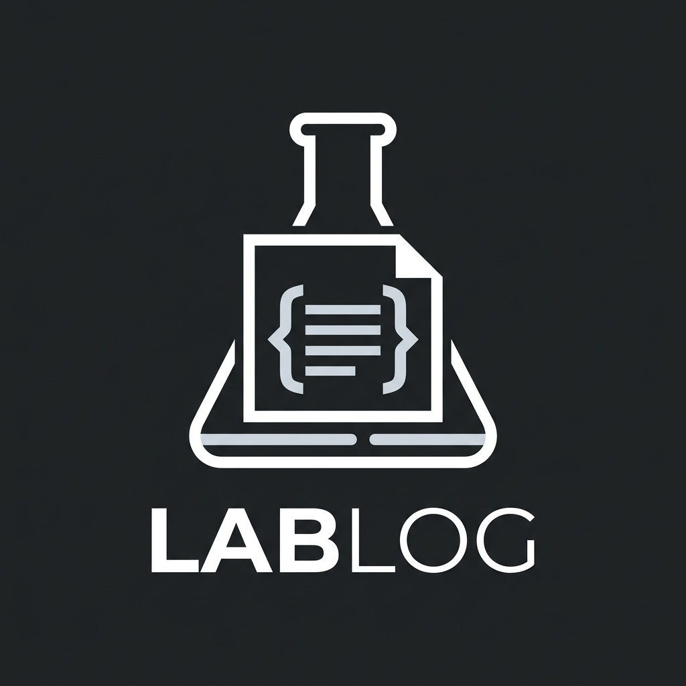

<br/>

<sub>USM · Valparaíso · Chile · built so the science can be written as it is done</sub>

<br/><br/>

[](https://github.com/kegouro/lablog)
[](https://pypi.org/project/jose-labarca-lablog/)
[](https://kegouro.github.io/lablog/)

</div>
