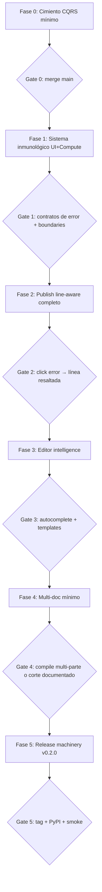

# Plan de Producción Maestro — lablog

> **Naturaleza del documento:** arquitectura de ejecución + orquestación de release.
> No es una lista de la compra. Define límites del sistema, invariantes, contratos y gates.
>
> **Versión objetivo de producto:** `v0.2.0`
> **Base real:** `v0.1.0` ya publicada (2026-07-05, PyPI `jose-labarca-lablog`)
> **Rama de cimiento:** `kegouro/ref/backend-headless-cqrs-refactor`
> **Fecha:** 2026-07-10

---

## 0. Autopsia (por qué el plan anterior y el “plan suizo” fallan)

### 0.1 Del plan tipo “lista de bugs v0.1.0”

El documento `lablog-production-plan.md` (Tasks 1–10) era un plan de **estabilización de release**. Como checklist de bugs sirvió; como arquitectura de sistema es mediocre:

| Fallo | Por qué importa |
|---|---|
| Sintomas sin ownership | “usar selectores” sin definir qué vive en client vs server state |
| CodeEngine como “poner un lock” | sin contrato de dominio (`execution_failed`), sin modelo de status en AST |
| XSS como “escapar a mano” | la defensa real es no inyectar HTML de usuario; el escape es remiendo |
| CI como “añadir workflow” | vago; no define gates de merge ni atomicidad de release |
| Sin orden de dependencias | features y refactors se pisan |

**Hecho verificable:** casi todos los bugs de ese plan **ya están cerrados en código y CHANGELOG 0.1.0**. Seguir “ejecutando” ese plan es teatro.

### 0.2 Del “plan suizo” (crítica de rigor)

La crítica exige rigor. Eso se adopta. Pero varias recetas **chocan con el plan de arquitectura ya aprobado** y con el código actual:

| Propuesta “suiza” | Veredicto | Motivo |
|---|---|---|
| Lexer LaTeX en TypeScript + backend valida | **Rechazada** | Reintroduce dualidad de parser. Acto I ya la amputó: **un solo parser en Python**. Frontend no parsea documento. |
| DOMPurify como defensa primaria XSS | **Secundaria / opcional** | Defensa primaria: `AstRenderer` + cero `dangerouslySetInnerHTML` de contenido de usuario. DOMPurify solo si queda un sink HTML inevitable (p.ej. overlay del editor). |
| `asyncio.Lock` + 202 Accepted + polling por celda | **Parcial** | Jupyter client es síncrono; hoy hay `threading.Lock` + auto-restart. El salto correcto es: **comando de dominio async-friendly + evento `execution_failed` + status en AST**, no un micro-orquestador de tareas genérico en v0.2. |
| Watchdog heartbeat cada 5s | **Diferido (post-0.2)** | Útil en multi-usuario; en single-user local el costo/complejidad no justifica. Hoy: restart on-demand si `is_ready()` es falso. |
| Selectores `useShallow` en todo | **Sí, como ley** | Ya usado en `app-shell` / `sidebar`. Falta ley dura + auditoría de restos. |
| Error Boundaries | **Sí, obligatorio** | Hoy: **cero**. Un KaTeX roto no puede tumbar la app. |
| CI matrix + cache + release atómico | **Sí** | CI paralelo ya existe; falta endurecer coverage gate, cache Python y smoke post-build. |
| FSM de voz | **Sí** | `resetTranscript` existe; no hay FSM explícita `IDLE→LISTENING→PROCESSING→IDLE`. |

### 0.3 Principio rector (no negociable)

Del `docs/ARCHITECTURE_MASTER_PLAN.md`, ratificado:

> **El AST es el Rey y vive en el Backend. El frontend es una terminal tonta, segura y reactiva.**

Cualquier “plan de producción” que reintroduzca parser de documento en UI, HTML crudo como pipeline de preview, o lógica de negocio en Zustand **queda invalidado**.

---

## 1. Estado real del sistema (mapa de verdad)

```
┌─────────────────────────────────────────────────────────────┐
│ UI (React 19)                                               │
│  textarea raw ──debounce──► PUT /pages/{id}                 │
│  AstRenderer(ast) ◄────────── page.ast JSON                 │
│  Zustand: shell + active page cache (aún no server-state)   │
│  PDF panel: errores clicables (raw 1:1)                     │
└───────────────────────────┬─────────────────────────────────┘
                            │ HTTP /api/v1
┌───────────────────────────▼─────────────────────────────────┐
│ API adapter (api.py ~900 LOC — aún grueso)                  │
│  commands.py (writes, en progreso)                          │
│  projections.py (reads, en progreso)                        │
│  projector ← events JSONL                                   │
│  pdf_engine (Tectonic + SourceMarker + parse_errors)        │
│  code_engine (threading.Lock + restart on dead)             │
│  vault / snippets / symbols                                 │
└─────────────────────────────────────────────────────────────┘
```

| Subsistema | Estado | Deuda crítica |
|---|---|---|
| Event store + projector | Estable | — |
| PUT raw → AST | Hecho | — |
| Parser frontend | Eliminado | No reintroducir |
| AstRenderer | Hecho | Completar nodos edge; boundaries |
| CodeEngine | Thread-safe básico | Status/eventos de fallo en todo el camino; no bloquear event loop sin cuidado |
| PDF line-aware | Parcial | Highlight en editor; mapeo modo wrapped; panel unificado |
| Zustand | Selectores parciales | Aún cachea datos de negocio; sin React Query |
| Error Boundaries | Ausente | Obligatorio |
| CI/Release | Operativo v0.1 | Gates + smoke + docs alineados |
| Multi-file / BibTeX / autocomplete | Ausente | Producto v0.2 |
| Plugins / P2P | Exploratory | **Fuera de alcance** |

### 1.1 Corrección al roadmap “oficial” del README

Algunas filas del README están desfasadas respecto al código:

| Milestone README | Realidad en código |
|---|---|
| Full LaTeX mode + error-to-line jump → Done | Hecho en **modo raw** (click a línea); highlight de gutter incompleto |
| In-app PDF line-aware → Planned | **Parcialmente hecho** (`SourceMarker`, `parse_errors`, panel de errores) |
| Multi-file + BibTeX → Planned | Ausente |
| Portable PyInstaller → Beta | Beta |
| Templates menu | Existe (5 plantillas genéricas); faltan de física/lab de dominio |

### 1.2 Qué ya está “wow” y no debe reimplementarse

- Event sourcing JSONL + proyección determinista
- `PUT /pages/{id}` + `AstRenderer` (sin parser UI)
- Compilación PDF real con Tectonic + errores mapeables
- Celdas Jupyter, vault, time-travel + diffs
- Desktop pywebview + packaging beta
- Export estático / GitHub Pages
- CI backend + frontend, PyPI release workflow

---

## 2. Arquitectura de ejecución (límites e invariantes)

### 2.1 Bounded contexts (lógicos, no carpetas obligatorias)

| Contexto | Responsabilidad | No hace |
|---|---|---|
| **Document** | parse raw → AST, eventos de texto/documento, proyección de página | Ejecutar código |
| **Compute** | ejecutar celdas, capturar output/figuras, fallos de kernel | Parsear LaTeX del documento |
| **Publish** | PDF Tectonic, export pandoc/site | Mutar documento |
| **Vault** | adjuntos, preview, time-lock | Interpretar LaTeX |
| **Shell UI** | paneles, tema, cursor, listen mode | Ser dueño del AST |

### 2.2 Invariantes (cierran PRs si se violan)

1. **I1 — Single writer del AST:** solo el projector, a partir de eventos. API no muta nodos en memoria “a mano” y los devuelve.
2. **I2 — Single parser:** solo `lablog.latex_ast`. Cero parser de documento en UI.
3. **I3 — Safe render:** contenido de página se renderiza como React/KaTeX desde AST tipado. Prohibido pipeline HTML de usuario sin sink auditado.
4. **I4 — Failures are domain:** fallos de celda/kernel producen eventos o status en proyección (`idle|running|ok|error`), no solo HTTP opaco.
5. **I5 — Config paths:** todo path configurable pasa por `config.py`.
6. **I6 — UI no inventa verdad:** tras write, la UI confía en la respuesta del backend (o re-fetch), no en un segundo modelo paralelo del documento.

### 2.3 Contratos HTTP estables (v0.2 no los rompe)

```
PUT  /api/v1/pages/{id}          body: { raw }     → PageDetail { id, raw, ast, version, ... }
GET  /api/v1/pages/{id}                            → PageDetail
POST /api/v1/pages/{id}/cells/{cid}/execute        → cell + status/output | error de dominio mapeado
GET  /api/v1/pages/{id}/export/pdf                 → PDF bytes | 422 { errors: CompileError[] }
GET  /api/v1/health                                → { engine_ready, tools }
```

**Contrato de error de compilación (ya semi-existente, se endurece):**

```json
{
  "detail": {
    "message": "Compilation failed",
    "errors": [
      {
        "message": "Undefined control sequence",
        "source_line": 42,
        "editor_line": 42,
        "kind": "raw|text|cell",
        "ref": "prose|cell_id"
      }
    ],
    "log": "..."
  }
}
```

**Contrato de error de cómputo:**

```json
{
  "error_code": "KERNEL_DEAD | EXECUTION_ERROR | UNSUPPORTED_LANGUAGE",
  "message": "...",
  "cell_id": "...",
  "traceback": ["..."]
}
```

El frontend ramifica UI por `error_code`, no por string matching frágil.

### 2.4 Orquestación del CodeEngine (diseño realista)

No se construye un “Kubernetes de kernels”. Se construye un **ciclo de vida acotado**:

```
request execute
    → command.execute_cell(store, engine, page_id, cell_id)
        → engine.execute (threading.Lock: serializa celdas)
            ok  → append cell_executed → project → status=ok
            err → append execution_failed → project → status=error
            start fail → EngineStartError → 503 KERNEL_DEAD (y opcional evento)
    → response con celda proyectada (source of truth)
```

| Pieza | Ahora | v0.2 |
|---|---|---|
| Lock | `threading.Lock` en engine | Mantener (Jupyter sync); **no** fingir asyncio mágico |
| Dead kernel | restart on-demand en `execute` | Mantener + error_code estable |
| Bloqueo del event loop | execute síncrono en hilo de request | `asyncio.to_thread` / run_in_executor en el endpoint de execute |
| Status en AST | campo `status` añadido en rama actual | UI lee solo del AST/respuesta, sin estado paralelo |
| Watchdog 5s | no | **No en 0.2** (Yagni) |
| 202 + task queue | no | **No en 0.2** salvo que execute siga matando latencia; entonces ticket 0.2.1 |

### 2.5 Orquestación de estado UI

| Capa | Contiene | Herramienta |
|---|---|---|
| Server truth | pages, ast, cells, vault metadata | hoy: fetch + store cache; **meta 0.2.x:** React Query/SWR |
| Client draft | `raw` del textarea, cursor, selección | estado local del editor + `use-page-update` debounce |
| Shell | paneles, theme, history open, listen mode | Zustand **solo con selectores** (`useShallow` si multi-campo) |

**Ley de Zustand (enforced en review):**

```ts
// PROHIBIDO
const state = useAppStore()

// OBLIGATORIO
const goToLine = useAppStore(s => s.goToLine)
const panels = useAppStore(useShallow(s => s.panels))
```

**KaTeX:** `throwOnError: false` (o catch por bloque en `AstRenderer`); error → nodo visual rojo; **nunca** excepción no capturada que tumbe el árbol. Error Boundary es la red de seguridad, no la estrategia primaria.

**XSS:**

1. Primario: no HTML de usuario.
2. Secundario: eliminar o acotar sinks (`latex-editor` overlay, `lab-canvas` markdown).
3. Si un sink HTML debe vivir: sanitizer estricto **solo ahí**, con test de payload.

---

## 3. Tesis de producto v0.2.0

**Promesa:** “compilo mi informe de lab, veo el error en la línea exacta, arranco desde una plantilla de física y el editor me ayuda con LaTeX — sin salir de lablog.”

**No-promesa:** collab P2P, plugins, multi-file full tipo Overleaf, citeproc completo en preview, Pharos embebido profundo.

### Principios de ejecución

1. **Event sourcing intacto:** nunca mutar AST proyectado desde la API; siempre evento + re-proyección (`AGENTS.md`).
2. **Un parser LaTeX:** solo backend (`latex_ast.py`).
3. **Features nuevas entran por commands/projections,** no hinchando más `api.py` sin extraer.
4. **Yagni:** multi-file = includes resueltos al compilar; no un VFS completo.
5. **Verificar antes de reclamar done:** pytest + ruff + mypy + UI build/lint + smoke manual.

---

## 4. Roadmap orquestado (fases con gates)



Cada fase tiene **entrada**, **salida medible**, **archivos**, **no-goals**. Sin gate verde no se abre la siguiente.

---

### Fase 0 — Cimiento: backend headless mínimo

**Entrada:** rama `kegouro/ref/backend-headless-cqrs-refactor`
**Meta:** writes/reads de dominio fuera del “god router” lo suficiente para que features nuevas no nazcan en `api.py` monolítico.

| ID | Trabajo | Evidencia |
|---|---|---|
| 0.1 | Commands de página/celda/replace/execute completos | `tests/test_commands.py` verde |
| 0.2 | Projections de page/history/cells unificadas con `node_to_json` | `tests/test_api.py` sin regressions |
| 0.3 | `execution_failed` proyecta `status=error` + output/traceback usable | test projector + API |
| 0.4 | Endpoint execute corre engine fuera del event loop si aplica | no freezes bajo load manual de 3 celdas |
| 0.5 | PR merge a `main` | CI verde |

**No-goals Fase 0:** SSE, React Query, partir `api.py` a 200 LOC, plugins, watchdog.

**Reuse:** `commands.py`, `projections.py`, `events.execution_failed`, `CellNode.status`, `node_to_json`.

**Gate 0:** merge en `main`; `pytest`, `ruff`, `mypy`, UI build/lint verdes.

---

### Fase 1 — Sistema inmunológico (estabilización de límites)

Esto es lo que el rigor pedía bien: no parches, **límites**.

| ID | Trabajo | Diseño |
|---|---|---|
| 1.1 | Auditoría Zustand | Grep de `useAppStore()` sin selector; eliminar; multi-field → `useShallow` |
| 1.2 | FSM de voz | Estados explícitos en `use-speech.ts`; transiciones documentadas; transcript se consume al entrar en `PROCESSING`; tests de no-double-append |
| 1.3 | Error Boundaries | Envolver `LatexPreview` y `LabCanvas` (y celdas individuales si aplica) con fallback UI |
| 1.4 | Cerrar sinks XSS | Inventario de `dangerouslySetInnerHTML`; cada uno: eliminar o sanitizar + test payload |
| 1.5 | Contratos de error compute | `error_code` estable; UI cells muestra KERNEL_DEAD vs traceback de ejecución |
| 1.6 | KaTeX no-throw | Errores por bloque en `AstRenderer`; boundary solo como red |

**Gate 1:**

- Payload `<script>alert(1)</script>` no ejecuta en preview/lab.
- 3 ejecuciones concurrentes no tiran el backend (serializan o fallan con contrato).
- Fallo KaTeX en un bloque no desmonta el documento.
- Dictado: una frase → un insert.

---

### Fase 2 — Publish: PDF line-aware como sistema

No “mejorar mensajes”. Un **pipeline de diagnóstico** con ownership claro.

```
raw/AST → build_document → markers[{tex_line, editor_line, kind, ref}]
        → tectonic → log
        → parse_errors(log, markers) → CompileError[]
        → UI ErrorPanel → goToLine(editor_line) + highlight(gutter)
```

| ID | Trabajo |
|---|---|
| 2.1 | Endurecer parser de log Tectonic (líneas `!`, `file:line:`, multi-line messages) |
| 2.2 | `editor_line` en `CompileError` (raw = 1:1; wrapped = offset de preámbulo + marcadores) |
| 2.3 | ErrorPanel único (preview + export menu) con click → editor |
| 2.4 | Resaltado temporal de línea en gutter del editor |
| 2.5 | Tests de log sintético → `editor_line` (sin Tectonic en unit tests) |

**Archivos:** `pdf_engine.py`, `tests/test_pdf_engine.py`, `latex-preview.tsx`, `latex-editor.tsx`, `api.ts`.

**Gate 2:** demo reproducible “error → click → línea resaltada” en documento full y en modo lablog-wrapped.

**No-goals:** BibTeX, multi-file, reescritura del motor.

**Estado base a potenciar (no greenfield):**

- Backend: `SourceMarker`, `parse_errors`, `CompileError` en `src/lablog/pdf_engine.py`
- Frontend: panel de errores clicable en raw (`latex-preview.tsx` + `goToLine`)

---

### Fase 3 — Editor intelligence (producto wow)

| ID | Trabajo | Diseño |
|---|---|---|
| 3.1 | Catálogo de completions | Módulo `ui/src/lib/latex-completions.ts` (+ opcional API labels). Fuentes: comandos, entornos, symbols API, snippets API |
| 3.2 | Overlay de autocomplete en textarea | Trigger `\`; navegación teclado; insert en cursor; **sin** migrar a CodeMirror en 0.2 |
| 3.3 | Templates de dominio físico | Catálogo **backend** `src/lablog/templates.py` (SSOT) expuesto a API + CLI + UI |
| 3.4 | Templates: informe lab, E&M, diario experimento, capítulo tesis | Placeholders + celda python de ejemplo donde aplique |
| 3.5 | CLI `lablog new --template=` | Crea página + `document_replaced` |

**Plantillas objetivo:**

| id | Nombre |
|---|---|
| `lab-report-physics` | Informe de laboratorio (física) |
| `em-notes` | Notas de clase E&M |
| `experiment-diary` | Diario de experimento |
| `thesis-chapter` | Capítulo de tesis parcial |

**Gate 3:** escribir `\` muestra sugerencias útiles; aplicar template de física en UI y CLI.

**Plan B documentado (no en 0.2):** CodeMirror 6 si el overlay es insuficiente.

**Reuse:** `TemplatesMenu`, `LATEX_TEMPLATES` (migrar a SSOT backend), `latex_symbols.py`, `snippets.py`.

---

### Fase 4 — Multi-documento mínimo (alcance quirúrgico)

**Modelo v0.2 (elige uno; recomendado A):**

- **A (recomendado):** resolución de includes en compile-time
  `\input{vault://file.tex}` o `\input{page:<uuid>}` expandido solo en `build_document`.
- **B:** `parent_id` en metadata + orden de hijos al compilar raíz.

| ID | Trabajo |
|---|---|
| 4.1 | Resolver includes en `build_document` con límites (depth max, ciclo detectado → error claro) |
| 4.2 | Tests de expansión sin Tectonic |
| 4.3 | BibTeX **solo si** vault `.bib` + camino feliz en Tectonic es trivial; si no → corte explícito a 0.2.1 |

**Gate 4:** un padre + un include compilan a un PDF, **o** issue de corte firmado en CHANGELOG “Known limitations”.

**No-goals:** proyecto multi-capítulos tipo Overleaf, citeproc en KaTeX, sync multi-device.

---

### Fase 5 — Release machinery v0.2.0

| ID | Trabajo |
|---|---|
| 5.1 | CI: jobs paralelos (ya); cache uv; **fail si coverage backend < 80%**; artifact de wheel en PR opcional |
| 5.2 | `release.yml` (ya existe): verificar tag-only, build UI→wheel, publish PyPI, assets |
| 5.3 | Smoke script: venv limpio → `pip install wheel` → `lablog serve` → curl `/api/v1/health` 200 |
| 5.4 | Docs: `docs/QUICKSTART.md` 5 minutos + alinear README roadmap |
| 5.5 | Portable bundle: checklist smoke macOS; documentar Linux/Windows |
| 5.6 | Bump 0.2.0, CHANGELOG, tag |

**Gate 5:** tag `v0.2.0` publicado; install limpio OK; health 200; compile PDF smoke manual OK.

---

## 5. Calendario (orquestación temporal)

| Ventana | Fase | Criterio de no-desborde |
|---|---|---|
| Día 0–1 | Fase 0 | Sin features de producto |
| Día 1–2 | Fase 1 | Sin multi-file / autocomplete |
| Día 2–4 | Fase 2 | PDF system completo |
| Día 4–5 | Fase 3 | Completions + templates |
| Día 5–6 | Fase 4 | Multi-doc mínimo o corte |
| Día 6–7 | Fase 5 | Release |

Si el tiempo aprieta: **corte ordenado** = BibTeX → Pharos → multi-file → (**nunca**) Fase 0/1/2.

---

## 6. Prioridad vs plan de 7 días original (usuario)

| Idea original | Veredicto de este plan |
|---|---|
| D1–2 PDF line-aware | **Sí**, tras Gate 0 y preferiblemente tras Gate 1; potenciar lo existente, no greenfield |
| D3 autocomplete + templates física | **Sí** (Fase 3) |
| D4 multi-file + BibTeX | **Multi-file sí; BibTeX condicional** (Fase 4) |
| D5 Pharos + vault/desktop | **Polish vault/desktop sí; Pharos fuera / opcional post-0.2** |
| D6 testing + portable + docs | **Sí** (Fase 5 + gates) |
| D7 release 0.2 + marketing | **Sí** (Fase 5) |
| Ignorar refactor CQRS en curso | **No** — Fase 0 es gate obligatorio |

---

## 7. Archivos críticos

| Capa | Paths |
|---|---|
| Dominio / ES | `src/lablog/events.py`, `projector.py`, `projections.py`, `ast_nodes.py`, `latex_ast.py` |
| Commands | `src/lablog/commands.py` |
| Compute | `src/lablog/code_engine.py` |
| Publish | `src/lablog/pdf_engine.py` |
| HTTP | `src/lablog/api.py` (solo adapter) |
| Config | `src/lablog/config.py` |
| UI truth | `ui/src/lib/api.ts`, `hooks/use-page-update.ts`, `lib/ast-render.tsx` |
| UI shell | `stores/app-store.ts`, `shell/app-shell.tsx`, `editor/latex-editor.tsx`, `preview/latex-preview.tsx` |
| Voice | `ui/src/hooks/use-speech.ts` |
| Cells | `panels/cells-panel.tsx`, `lab/lab-canvas.tsx` |
| Templates (hoy) | `ui/src/lib/latex-templates.ts`, `shell/templates-menu.tsx` |
| Templates (meta) | `src/lablog/templates.py` (**nuevo**, SSOT) |
| Completions (meta) | `ui/src/lib/latex-completions.ts` (**nuevo**) |
| Release | `pyproject.toml`, `CHANGELOG.md`, `.github/workflows/*`, `scripts/*` |

### Existing utilities to reuse (no reinventar)

| Utilidad | Path |
|---|---|
| `parse_errors` / `SourceMarker` / `CompileError` | `src/lablog/pdf_engine.py` |
| `build_document` | `src/lablog/pdf_engine.py` |
| `compilePdf` / `PdfCompileError` | `ui/src/lib/api.ts` |
| `goToLine` | `app-store` + editor |
| `updatePageRaw` + debounce | `api.ts`, `use-page-update.ts` |
| `replace_document` / `document_replaced` | `commands.py`, `events.py` |
| `AstRenderer` | `ui/src/lib/ast-render.tsx` |
| `LATEX_TEMPLATES` + `TemplatesMenu` | `latex-templates.ts`, `templates-menu.tsx` |
| Symbols + snippets APIs | `latex_symbols.py`, `snippets.py` |
| Vault | `vault.py`, `vault-panel.tsx` |
| Export estático | `exporter.py`, `scripts/build_demo_site.py` |
| CITATION | `CITATION.cff` |

---

## 8. Definition of Done — v0.2.0

### Producto

- [ ] Click en error PDF salta y resalta línea del editor
- [ ] Autocomplete LaTeX usable en el editor
- [ ] Templates de física + `lablog new --template`
- [ ] Multi-include mínimo **o** known limitation documentada
- [ ] Fallos de kernel/celda con `error_code` y UI accionable

### Arquitectura

- [ ] I1–I6 no violados en el diff de 0.2
- [ ] Cero parser de documento en frontend
- [ ] Sinks HTML inventariados y seguros
- [ ] Zustand sin suscripciones globales
- [ ] Commands/projections son el camino de writes/reads nuevos

### Operación

- [ ] CI paralelo + coverage gate
- [ ] Smoke install wheel
- [ ] Tag + PyPI 0.2.0
- [ ] README/CHANGELOG/IMPLEMENTATION_PLAN alineados con realidad

---

## 9. Verification (evidencia, no narrativa)

### Automatizado (cada gate)

```bash
source .venv/bin/activate
uv sync --extra dev
pytest -q --cov=lablog --cov-fail-under=80
ruff check src tests
mypy -p lablog
cd ui && npm test && npm run build && npm run lint
```

### Manual por gate

| Gate | Prueba |
|---|---|
| 0 | Crear/editar/ejecutar/export en build de la rama mergeada |
| 1 | XSS payload; 3 celdas; KaTeX roto; dictado |
| 2 | Error LaTeX deliberado → click → highlight |
| 3 | `\` autocomplete; template física UI+CLI |
| 4 | Padre+include PDF o CHANGELOG limitation |
| 5 | venv limpio + health + PDF smoke |

### Smoke post-release

1. `lablog serve` → crear página → aplicar template física → editar.
2. Autocomplete: `\` → elegir entorno → cierra si aplica.
3. Error LaTeX → Compilar PDF → click error → cursor/resaltado correctos.
4. Celda con división por cero → status error + traceback.
5. Dictado una frase → un solo insert.
6. Vault: subir imagen/CSV → preview.
7. Time-travel: restore no corrompe.
8. (Si multi-file) padre + hijo → un PDF.
9. Wheel limpio: `pip install dist/*.whl && lablog --help`.

---

## 10. No-goals (explícitos — no negociar en silencio)

- Plugins system / skill framework genérico
- P2P collab / device sync
- CodeMirror/Monaco migration (salvo plan B post-0.2)
- Dual parser TypeScript del documento
- Kernel supervisor con heartbeat 5s en 0.2
- Cola de tasks 202 Accepted genérica en 0.2
- Pharos parcella/curvana embebido profundo
- Blame granular time-travel
- Vault magic ingest completa
- “Clean Architecture” de carpetas `domain/application/infrastructure` completa (solo CQRS ligero ya en marcha)

---

## 11. Riesgos y mitigaciones

| Riesgo | Mitigación |
|---|---|
| Features se mezclan con refactor a medias | Gate 0: no features de producto hasta merge |
| Mapeo línea PDF ↔ editor incorrecto en modo wrapped | Tests con marcadores sintéticos; raw mode como camino feliz garantizado |
| Autocomplete en textarea se siente barato | Ship overlay bueno; ticket CM6 post-0.2 si feedback malo |
| BibTeX rompe CI/offline Tectonic | Feature flag o defer; nunca bloquear compile sin .bib |
| Scope creep Pharos/P2P | Lista de no-goals; plan lo prohíbe en 0.2 |
| `api.py` sigue grande | Aceptable en 0.2 si commands/projections cubren writes/reads nuevos |

---

## 12. Relación con documentos previos

| Documento | Rol tras este plan |
|---|---|
| `lablog-production-plan.md` | Histórico de bugs 0.1 — **archivado conceptualmente** |
| `docs/ARCHITECTURE_MASTER_PLAN.md` | Constitución de ownership AST — **sigue vigente** |
| `docs/plans/2026-07-07-acto-ii-backend-headless.md` | Detalle táctico Fase 0 |
| `docs/IMPLEMENTATION_PLAN.md` | Actualizar al cerrar 0.2 |
| `docs/PRODUCTION_MASTER_PLAN.md` (este archivo) | **Orquestador de producción v0.2** |

---

## 13. Primer movimiento post-aprobación

1. Cerrar **Gate 0** (Fase 0 en la rama actual → PR → main).
2. Inmediatamente **Fase 1** (inmunológico): selectores, FSM voz, boundaries, sinks XSS, contratos de error.
3. Solo entonces **Fase 2** PDF line-aware como sistema de diagnóstico.

Sin Gate 0, no hay “features wow”: hay deuda con maquillaje.
